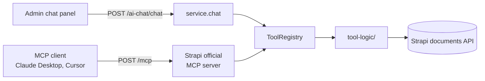
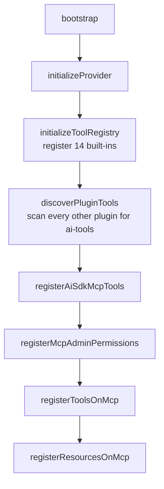
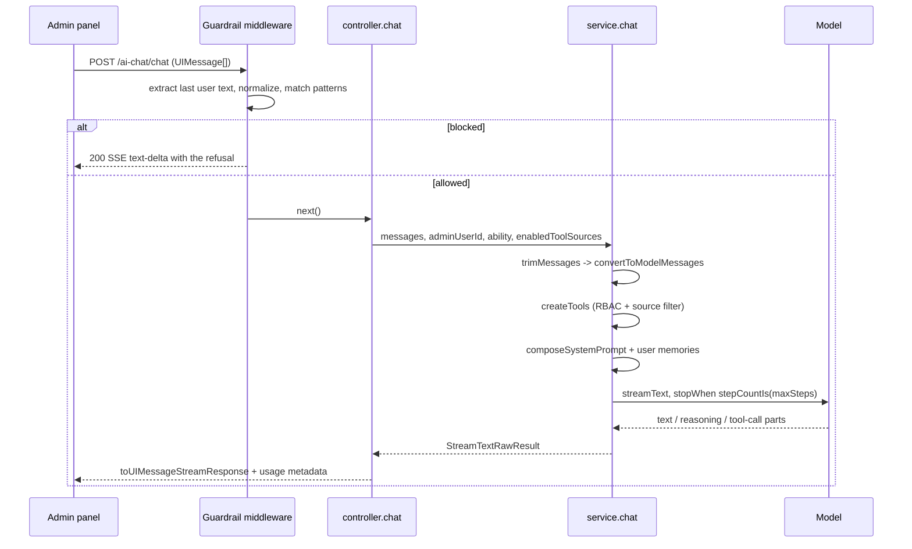

# Architecture

How the plugin is put together, and why the parts that look odd are shaped the
way they are. Current as of **3.0.0**.

For installation and configuration, see the [README](../README.md). For writing
a plugin that contributes tools, see [plugin-contract.md](./plugin-contract.md).

## Contents

- [What this plugin is](#what-this-plugin-is)
- [Map of the codebase](#map-of-the-codebase)
- [Lifecycle](#lifecycle)
- [The provider layer](#the-provider-layer)
- [The tool registry](#the-tool-registry)
- [Plugin tool discovery](#plugin-tool-discovery)
- [The permission model](#the-permission-model)
- [The system prompt](#the-system-prompt)
- [A chat request, end to end](#a-chat-request-end-to-end)
- [Stopping a turn](#stopping-a-turn)
- [Withdrawing a tool after a write](#withdrawing-a-tool-after-a-write)
- [The MCP surface](#the-mcp-surface)
- [Guardrails](#guardrails)
- [Storage](#storage)
- [The context budget](#the-context-budget)
- [Admin panel](#admin-panel)
- [HTTP endpoints](#http-endpoints)
- [Testing](#testing)
- [What used to be here](#what-used-to-be-here)

---

## What this plugin is

Two things sharing one tool registry:

| Surface | Transport | Caller authenticates as | Tool set |
|---|---|---|---|
| Admin chat | `POST /ai-chat/chat`, SSE | Logged-in admin | What that admin's **role** grants |
| MCP | Strapi's own `POST /mcp` | Admin API token | What that **token** grants |

The plugin does not serve `/mcp`. Strapi 5.47 ships an official MCP server, and
this plugin registers its tools onto it during `bootstrap()`. Everything
MCP-side in `server/src/mcp/` is registration code, not transport code.

The single registry is the point. A tool is written once and both surfaces get
it, gated by the same permission action, with the same failure handling.



---

## Map of the codebase

```
server/src/
  index.ts              Strapi plugin export
  register.ts           no-op; everything happens in bootstrap
  bootstrap.ts          provider init, registry init, tool discovery, MCP registration
  destroy.ts
  config/               defaults + validator
  content-types/        conversation, memory, note, public-memory, task
  controllers/          chat + diagnostics, and CRUD per content type
  routes/admin/         every route; all admin-authenticated
  services/
    service.ts          chat orchestration, system prompt composition
    provider.ts         exposes AIProvider.registerProvider to host apps
  middlewares/          guardrail middleware registration
  guardrails/           input screening (chat route only)
  lib/
    ai-provider.ts      provider registry, lazy model resolution
    tool-registry.ts    ToolDefinition, ToolRegistry
    tool-permissions.ts action id for a tool; used by three call sites
    close-tools-after-write.ts
    context-budget.ts   preamble cost, context window detection
    stored-messages.ts  conversation storage contract + legacy migration
    trim-messages.ts    history truncation
    check-compat.ts     advisory peer-version check for contributing plugins
    model-tag.ts        model id matching for health checks
    json-coercible.ts   Zod helper for JSON-string tolerance
  mcp/
    index.ts            registration entry point
    register-tools.ts   registry -> official MCP server
    register-resources.ts
    permissions.ts      one admin action per tool
    naming.ts           camelCase -> snake_case, action slugs, display names
    access.ts           risk tiers (metadata only)
    size-guard.ts       ~1MB MCP response ceiling
  tools/
    index.ts            registry -> AI SDK ToolSet, with the RBAC filter
    definitions/        14 built-in tool definitions
  tool-logic/           the implementations, independent of both surfaces

admin/src/
  index.ts              menu link + plugin registration
  pages/                App (routes), HomePage, MemoryStore, NoteStore, PublicMemoryStore
  components/           Chat and its parts
  hooks/                useChat, useConversations, useMemories, useNotes, useToolSources
  utils/                auth, per-resource API clients
```

The split between `tools/definitions/` and `tool-logic/` is deliberate. A
definition is metadata — name, description, schema, flags. The logic is a plain
function of `(strapi, args)` that knows nothing about registries, MCP or chat,
which is what makes it directly testable.

---

## Lifecycle

`register()` is empty. All initialization is in `bootstrap()`, in this order:



The order is not cosmetic. Discovery must finish before MCP registration,
because the official MCP server locks its capability set when it starts — a tool
discovered afterwards would never appear. And permissions must be registered
before tools, because the server gates each tool behind an action string that
has to exist in the admin permission registry first.

The whole MCP branch is wrapped in one try/catch that degrades to a logged
error. Reading `strapi.ai?.mcp` or calling `isEnabled()` must never be able to
crash boot: `strapi.ai` is absent below Strapi 5.47, and a host shape change
across versions should cost you MCP tools, not the application.

---

## The provider layer

`lib/ai-provider.ts` holds a static registry of named provider creators and
resolves one lazily.

```typescript
AIProvider.registerProvider('anthropic', ({ apiKey, baseURL }) => {
  const provider = createAnthropic({ apiKey, baseURL });
  return (modelId: string) => provider(modelId);
});
```

Two are registered in `bootstrap()`: `anthropic` and `openai-compatible`. A host
app registers its own through the `provider` service:

```typescript
// src/index.ts
register({ strapi }) {
  strapi.plugin('ai-chat').service('provider').register('my-model', creator);
}
```

**Resolution is deferred to first model use**, not done at `initialize()`. That
is what makes registration timing irrelevant — a host app registering from its
own `register()` or `bootstrap()` works either way, in any order relative to
this plugin's bootstrap. `ensureModelFactory()` resolves on demand and throws a
message naming the registered providers if the name is unknown.

Three behaviours worth knowing:

**A blank `baseURL` is treated as absent.** `env('AI_BASE_URL')` returns `""`
for a variable that exists but is empty, and an empty string still counts as set
by the time it reaches a provider — the Anthropic SDK joins it with the request
path and calls `/messages`, which fails as `Invalid URL` rather than as the
configuration mistake it is.

**Self-hosted runtimes need no API key.** Ollama, vLLM and LM Studio accept any
bearer token or none. For `openai-compatible` the required field is `baseURL`;
for everything else it is `apiKey`. Missing either disables AI features with a
warning rather than throwing.

**Sampling parameters are omitted unless configured.** `temperature`, `topP`,
`topK`, `frequencyPenalty`, `presencePenalty`, `seed` and `providerOptions` are
each spread in only when defined. Newer Anthropic models reject `temperature`
outright, so carrying a default broke every request on the current default
model.

`apiKey` is provider-neutral and preferred. `anthropicApiKey` still works as a
fallback and logs a one-time deprecation warning.

---

## The tool registry

A `ToolDefinition` is:

```typescript
interface ToolDefinition {
  name: string;
  description: string;
  schema: z.ZodObject<any>;
  execute: (args, strapi, context?) => Promise<unknown>;
  internal?: boolean;      // chat only, never exposed over MCP
  publicSafe?: boolean;    // risk metadata; grants nothing
  access?: AccessTier;     // 'read' | 'write' | 'destructive' | 'maintenance'
}
```

`ToolRegistry` is a `Map` plus a second map of per-source metadata. The
distinctions that matter:

- `getAll()` — everything. Used to build the chat tool set.
- `getPublic()` — everything without `internal: true`. Used for MCP registration
  and for building the permission actions, so a tool and its permission cannot
  drift apart.
- `getToolSources()` — tools grouped by their `<source>__` prefix, which drives
  the tool-source toggles in the chat toolbar.

**14 built-in tools.** Eight reach MCP:

`listContentTypes`, `searchContent`, `findOneContent`, `aggregateContent`,
`createContent`, `updateContent`, `uploadMedia`, `sendEmail`

Six are `internal: true` — chat-only bookkeeping scoped to the calling admin's
own rows: `saveMemory`, `recallMemories`, `recallPublicMemories`, `saveNote`,
`recallNotes`, `manageTask`.

### `publicSafe` grants nothing

It used to decide what anonymous public chat could reach, which failed open: a
tool author forgetting the flag was the only thing between a visitor and a write
tool. Anonymous chat now lives in a separate plugin with an explicit allow-list.

What survives is risk metadata. `tierFor()` reads
`access ?? (publicSafe ? 'read' : 'write')` to label a tool in the permissions
grid and to decide which tools get withdrawn after a successful write. It is a
hint for a human, not a boundary.

`maintenance` is never derived. A tool lands there only by an explicit
`access: 'maintenance'`, because "expensive to run" is not inferable the way
"read-only" is — a read-only semantic search that calls a paid embeddings API
per query belongs there on cost grounds alone.

---

## Plugin tool discovery

At boot, every other installed plugin is checked for a service named
`ai-tools`:

```typescript
strapi.plugin(pluginName)?.service?.('ai-tools')
```

If it exists and exposes `getTools()`, the returned definitions are registered
under a namespace: `<pluginName>__<toolName>`, with any character outside
`[a-zA-Z0-9_-]` in the plugin name replaced by `_`. A double underscore is the
separator because tool names are restricted to that character class, so it
cannot collide with a camelCase name.

Definitions missing `name`, `execute` or `schema` are skipped with a warning.
Duplicates are skipped rather than overwriting. A throw anywhere in one plugin's
discovery is caught and logged — one bad plugin cannot stop the others being
found.

An optional `getMeta()` returning `{ label, description, keywords? }` is stored
as source metadata and surfaces in the tool-guide MCP resource.

`checkPluginCompat()` compares the contributing plugin's declared
`peerDependencies['strapi-plugin-ai-chat']` against this plugin's actual version.
It is advisory: a mismatch warns, never blocks.

Full contract in [plugin-contract.md](./plugin-contract.md).

---

## The permission model

**One admin action per MCP-exposed tool**, plus one for the tool guide:

```
plugin::<owning-plugin>.tool.<action-slug>
```

`<owning-plugin>` is the plugin that contributed the tool, not always `ai-sdk`.
A tool from `ai-sdk-yt-transcripts` registers as
`plugin::ai-sdk-yt-transcripts.tool.fetch-transcript`, appearing in that
plugin's own section of the permissions grid. This keeps the ai-chat section
listing only what it owns.

`<action-slug>` is the MCP name with its source prefix stripped and underscores
swapped for hyphens, because Strapi's admin action uid validator accepts only
lowercase letters, dots and hyphens. The grid groups them under the subcategory
**AI tools** — deliberately not "MCP tools", since the same actions gate
in-Strapi chat.

### The same action gates three call sites

| Call site | Caller | Effect of an ungranted action |
|---|---|---|
| `mcp/register-tools.ts` | Admin API token | Tool absent from `tools/list` |
| `tools/index.ts` | Admin user's role | Tool never offered to the model |
| `controllers/controller.ts` | Admin user's role | Source hidden from the toolbar picker |

This is why `actionForTool()` lives in `lib/`, not `mcp/` — only one of the
three is MCP.

The third exists because without it the chat UI offers toggles for tools the
caller cannot use, and turning one on appears to do nothing.

### Internal tools are exempt

`buildMcpActionDefs()` walks `getPublic()`, so no action is ever registered for
an `internal` tool. Gating them in chat would therefore withhold them from
everyone including Super Admin, since the action they would need does not exist
to be granted. `tools/index.ts` skips the check for them explicitly.

### An empty tool list is the normal upgrade symptom

Registering actions and granting them are different things. A token holding none
of these actions gets a successful but **empty** `tools/list` — no error, and
the boot logs still read as success.

That is exactly the state an upgrade lands in, because Strapi prunes permission
rows whose action id no longer exists, and the pre-1.2.0 scheme used four tier
actions (`plugin::ai-sdk.mcp.read` and friends, under the plugin id of
the time) that are gone.
`warnIfNothingGranted()` counts rows in `admin::permission` matching any
registered action and logs a warning naming the fix. It is advisory and never
throws.

One table covers both callers: `admin::permission` holds role grants and admin
token grants alike. `admin::api-token-permission` belongs to content-API tokens
serving `/api/*`, which never hold `.tool.` actions.

---

## The system prompt

`composeSystemPrompt()` assembles three pieces:

```
base                 override ?? config.systemPrompt ?? DEFAULT_PREAMBLE
+ tool descriptions  substituted into {tools} if present, else appended
+ TOOL_DISCIPLINE    always appended last
```

`DEFAULT_PREAMBLE` covers role, the analytics-vs-search steer, Strapi filter
syntax for relations, and proactive task handling.

`TOOL_DISCIPLINE` is appended rather than substituted, and that is the whole
point of it. A site setting `systemPrompt` for tone used to silently lose every
piece of tool guidance the plugin ships. Replacing the base prompt is right for
role and voice; dropping the rules that keep a tool loop honest is not.

Each of its rules answers an observed failure, not a hypothetical: a model that
announced "I will now save this draft" and ended its turn; one that reported a
save that never happened after a single rejected write; one that sent a value to
a field whose limit it had already been told.

Tool descriptions are generated from the live tool set by `describeTools()`, so
they cannot drift from what is actually registered.

`buildPreamble()` assembles the system prompt and tool set exactly as a chat
request would, and is shared with the context report — a separate approximation
would drift, and a budget number that is quietly wrong is worse than none.

---

## A chat request, end to end



Details that matter:

**History is trimmed, not truncated blindly.** `trimMessages()` keeps the last
`maxConversationMessages` (default 15) and then drops leading assistant messages
carrying orphaned tool calls, since the AI SDK throws `MissingToolResultsError`
on a tool call whose result was sliced away.

**Memories are injected per request.** For an authenticated admin, rows in
`plugin::ai-chat.memory` filtered to that `adminUserId` are appended to the
system prompt. A failure here warns and continues; it never fails the request.

**Tool errors are rethrown, not returned.** `createTools()` wraps every
`execute` and rethrows through `describeToolFailure()`, which flattens Strapi's
`details.errors` into the message. Strapi summarises multi-field validation as
"3 errors occurred" and keeps the causes in a field the AI SDK never serialises,
so a model handed that count can only guess again. Rethrowing rather than
returning is what marks the step a tool error, which is what lets the model
retry.

**Usage rides back on the finish part.** `toUIMessageStreamResponse()` is given
a `messageMetadata` callback that attaches
`{ inputTokens, outputTokens, totalTokens }` to the assistant message on
`finish`. Without it the panel has no idea what a turn cost, and the point at
which a conversation stops fitting arrives with no warning.

**The response is a Web stream converted for Koa** via `Readable.fromWeb`, with
`x-vercel-ai-ui-message-stream: v1` and `X-Accel-Buffering: no` set so proxies
do not buffer it.

---

## Stopping a turn

Three mechanisms, covering three different ways a turn goes wrong.

### The Stop button

`useChat` exposes the SDK's own `stop()`, and `ChatInput` swaps Send for Stop
while a turn is running — replacing it rather than sitting beside it, since a
disabled Send with a spinner offers no way out of exactly the state the button
exists for. Whatever streamed in before the stop stays in the conversation: a
half-written answer is more useful than none, and it records which tools ran.

### Server-side abort

A client stop only aborts the browser's fetch. On its own that leaves the server
streaming into a socket nobody is reading, the model still generating, and the
remaining tool calls still running — a stopped turn that goes on costing tokens
and still writes whatever it was about to write.

So `controller.chat` wires an `AbortController` to the response and passes the
signal to `streamText`, which cancels the run and every step after it. The SDK
also hands that signal to each tool's `execute`, so a tool can cancel its own
work.

The listener is on `ctx.res`, not `ctx.req`, guarded by `writableFinished`:

```typescript
ctx.res.once('close', () => {
  if (!ctx.res.writableFinished) abort.abort();
});
```

`req`'s `'close'` also fires on a normally completed request in current Node,
which would abort every healthy stream. The response-side check distinguishes
"the client went away" from "we finished sending".

### Tool timeouts

The one that matters most, because it needs nobody watching.

Nothing else bounds a tool call. A network call with no timeout of its own —
a transcript fetch against a host that has started blocking you — hangs the
whole turn: a spinner on a tool that will never settle, a step that never
completes, and no error anywhere to explain it.

`createTools()` races every `execute` against `toolTimeoutMs` (default 60,000;
`0` disables it). On expiry the derived signal is aborted and the call rejects
with a message naming the tool and the elapsed time, plus an instruction not to
assume it succeeded. Because tool errors are rethrown rather than returned, that
reaches the model as an ordinary tool error it can report or retry.

A tool that honours its `abortSignal` stops immediately. One that ignores it
keeps running in the background — the turn is freed either way, which is the
point.

---

## Withdrawing a tool after a write

Models re-plan from scratch on every step. After `createContent` returns,
nothing in the conversation says the work is finished and the tool is still on
the table, so calling it again is a plausible next move. Observed against
`qwen3.6-35b`: three or four `createContent` calls for one article, then a
summary. When the step limit interrupts that loop the turn ends with
`finishReason: 'tool-calls'` and no text, which renders as an empty message.

`closeToolsAfterWrite()` builds a `prepareStep` handler that removes any
mutating tool which has already **returned a result**:

- Mutating means `tierFor(def) !== 'read'` — derived from the same metadata as
  permissions.
- It keys on `toolResults`, not `toolCalls`, so a tool that threw stays
  available for a corrected retry.
- It returns `{ activeTools }`, not `{ tools }`. `PrepareStepResult` has no
  `tools` field, so returning one is silently ignored and the model keeps
  everything.

Read tools are never withdrawn — re-reading is legitimate, whether searching
again with different filters or fetching the document just created.

---

## The MCP surface

`registerToolsOnMcp()` walks `getPublic()` and registers each tool:

```typescript
mcp.registerTool({
  name: toSnakeCase(name),
  title: toTitle(name),
  description: def.description,
  resolveInputSchema: () => def.schema,
  resolveOutputSchema: () => LOOSE_OUTPUT,
  auth: { policies: [{ action: actionForTool(name) }] },
  createHandler: (strapi) => async ({ args }) => { ... },
});
```

**Zod 4 schemas are handed over untouched.** The MCP SDK detects Zod 4 by
duck-typing and converts with its own bundled `zod/v4-mini`. Adding a conversion
layer would strip `.describe()` text, which is most of what tells a model how to
call the tool.

**Output schemas are deliberately loose.** `resolveOutputSchema` is required and
must be a `ZodObject`, but these tools return heterogeneous shapes, so one
permissive `z.object({}).catchall(z.any())` satisfies the contract for all of
them. Because it must be an object, array and scalar results are wrapped as
`{ result }` for `structuredContent`.

**Each registration gets its own try/catch.** The capability registry throws
synchronously on conflicts — a duplicate name across plugins, a missing auth
policy. One bad tool must not take down the registration pass or Strapi's boot,
so failures skip and continue with a warning.

**Errors are a separate branch of the union**: `isError: true` with no
`structuredContent`, never both.

### Naming

| Function | Purpose | Example |
|---|---|---|
| `toSnakeCase` | registry name -> MCP name | `searchContent` -> `search_content` |
| `toTitle` | human title | `Strapi: Search Content` |
| `toBareMcpName` | strip source prefix | `..._yt__fetch_transcript` -> `fetch_transcript` |
| `toActionSlug` | permission uid tail | `fetch-transcript` |
| `toDisplayName` | grid checkbox label | `Fetch transcript` |
| `getToolSource` | owning plugin, or `built-in` | |

The asymmetry is intentional: MCP names stay snake_case, action slugs use
hyphens, because Strapi's uid validator rejects underscores.

### The size guard

MCP clients reject a tool result over roughly 1 MB with an opaque error the
agent cannot act on. `guardSize()` replaces an oversized result with a
structured notice naming the tool, the size, the limit and a per-tool hint for
making the next call smaller.

The measurement doubles the serialized size, because the result rides the wire
twice — once as JSON text in `content`, once as `structuredContent`. The ceiling
is `MAX_WIRE_BYTES = 950_000`.

### The tool guide resource

The official server does not let plugins set server-level `instructions`, so the
usage guidance the retired custom server used to send lives in a resource at
`strapi://ai-chat/tools/guide`, gated by its own `plugin::ai-chat.tool.guide`
action. It is generated per read, so newly discovered plugin tools appear
without a restart.

---

## Guardrails

A Koa middleware registered as `plugin::ai-chat.guardrail` and attached to
`POST /chat` only. Full detail in [guardrails.md](./guardrails.md); the shape:

1. `beforeProcess` hook, if configured — runs first and can block or sanitize.
2. Normalize: NFKC, strip zero-width and invisible characters, collapse
   whitespace.
3. Match 29 default regex patterns across five categories, plus any
   `additionalPatterns`.
4. Length check against `maxInputLength` (default 10,000).

A block on the chat route responds `200` with an SSE `text-delta` carrying the
refusal, so the panel renders it as a normal assistant message rather than a
failed request. Other routes get `403`.

**MCP tool calls are not screened.** The middleware is on this plugin's chat
route; `/mcp` is Strapi's endpoint and never passes through it.

---

## Storage

Five content types, all scoped by `adminUserId` except `public-memory`:

| Type | Collection | Holds |
|---|---|---|
| `conversation` | `ai_chat_conversations` | `title`, `messages` (json), `adminUserId` |
| `memory` | `ai_chat_memories` | `content`, `category`, `adminUserId` |
| `note` | `ai_chat_notes` | `title`, `content`, `category`, `tags`, `source`, `adminUserId` |
| `public-memory` | `ai_chat_public_memories` | `content`, `category` |
| `task` | `ai_chat_tasks` | `title`, `description`, `content`, `done`, `priority`, `consequence`, `impact`, `dueDate`, `adminUserId` |

### The conversation format has a contract

`messages` is `"type": "json"`, so Strapi stores whatever it is handed and
validates nothing. Before `lib/stored-messages.ts` the shape was implicitly
whatever the admin panel's `Message` interface happened to be when a row was
written.

Storage is now a versioned envelope holding the AI SDK's `UIMessage`:

```json
{ "v": 2, "messages": [ { "id": "...", "role": "assistant", "parts": [] } ] }
```

Two reasons. The old `{ content: string, toolCalls: [] }` shape lost
information — a turn that ran text, then a tool, then more text could not be
reconstructed from one string with a list beside it, while an ordered `parts[]`
can. And it is what the rest of the stack already speaks, which removes the
translation layer where lossy bugs live.

Part validation is by prefix, not enumeration: tool parts are typed
`tool-<toolName>`, so a new tool never requires a schema change. Unrecognised
part types — `reasoning`, `source-url`, `file`, whatever comes next — are
preserved verbatim rather than rejected, since dropping them would damage the
conversation for a future version that understands them.

**Migration happens on read, not as a script.** `readStoredMessages()` tries the
current envelope, falls back to the v1 bare array, and converts. It is
deliberately total: an unparseable row returns empty rather than throwing,
costing the user that conversation's history rather than the ability to open the
page. `toStoredMessages()` accepts the envelope, a bare `UIMessage[]`, or the
legacy shape on write, which is what makes rows heal by being touched.

---

## The context budget

The most expensive failure in this plugin is invisible. A chat request carries
the system prompt and every tool's JSON schema before the user's question —
close to 7,000 tokens against a real app. Ollama serves a 4,096 token window
unless the model file sets `num_ctx`, so a model advertising 262,144 tokens can
be quietly truncated to less than the preamble needs. There is no error. The
model hangs, or answers while ignoring its tools, and the obvious conclusion is
that tool calling is broken.

`GET /context-info` reports the numbers. It measures the preamble for **the
calling admin**, because the tool set is filtered by their role: two admins on
the same install face different preambles, and the one with more tools is closer
to the edge.

Window detection, in order:

1. `config.contextWindow` — an explicit override wins.
2. Ollama `/api/ps` — a loaded instance reports what it is actually serving.
3. `num_ctx` in the model file via `/api/show`.
4. `OLLAMA_DEFAULT_NUM_CTX` (4,096) — the case worth catching.

`/api/show` also yields the trained context length, so the report can say "this
model supports 262144 but is serving 4096".

`warnAboutBudget()` fires when the preamble does not fit at all, when it exceeds
half the window (which leaves too little for tool results and a reply), or when
Ollama's default is silently truncating a model that supports more.

Counts are estimated at four characters per token rather than measured with a
real tokenizer. Loading one per provider would add a dependency and a startup
cost to a number whose only job is to say whether you are near the edge. Callers
are told it is an estimate via `estimated: true`.

---

## Admin panel

`admin/src/index.ts` adds a menu link and registers the plugin. `App.tsx` routes
four pages: chat (index), `memory-store`, `note-store`, `public-memory-store`.

```
HomePage
  ModelBadge                provider/model, LOCAL badge, reachability
  Chat
    ConversationSidebar     list, select, new, delete
    ChatTopBar
      ToolSourcePicker      per-source toggles
      ContextBadge          used vs available, amber >60%, red >90%
    MessageList
      ToolCallDisplay       per-tool-call rendering
      TaskConfirmCard       inline form for task scoring
    ChatInput
    NotePanel / MemoryPanel slide-over panels
```

### `useChat`

A thin wrapper over `@ai-sdk/react`'s own `useChat`. It configures a
`DefaultChatTransport` and passes the SDK's state through, plus a few helpers
for reading parts: `messageText`, `messageReasoningText`,
`hasStreamingReasoning`, `messageToolParts`, `toolPartName`.

It replaced roughly 256 lines of hand-rolled SSE parsing that handled three
event types and silently discarded the rest — `error` among them, which is why a
failed stream used to surface as "No response received" instead of the
provider's actual complaint.

Three things it does deliberately:

**Auth headers resolve per request**, not captured once. A token refreshed
mid-session would otherwise start returning 401s that look like a server fault.

**`id` is the conversation id**, which recreates the underlying `Chat` on switch
so a new conversation does not append to the previous one's messages.

**History is seeded through `setMessages` in an effect**, not the `messages`
option. Conversations arrive asynchronously; the SDK reads that option only when
it constructs a `Chat`, so history arriving later was never adopted — the panel
rendered the right number of empty bubbles because the messages existed but
carried no parts.

Saving is driven by the loading edge: when `isLoading` goes true -> false, the
conversation is persisted and the memory and note panels refresh.

### Reasoning

Thinking models emit `reasoning` parts alongside tool calls and text. These are
stored like any other part and rendered in a collapsible panel that opens itself
while streaming and settles to "Thought for a moment" with a preview. Typing
dots appear only when there is no reasoning to show.

The empty-reply note is separate and still fires on a turn that used tools
without answering — reasoning is not a reply.

---

## HTTP endpoints

All routes are `type: 'admin'` and require an authenticated admin. Only `/chat`
carries the guardrail middleware.

| Method | Path | Handler |
|---|---|---|
| POST | `/chat` | streaming chat (guardrailed) |
| GET | `/model-info` | provider, model, baseURL, `isLocal` |
| GET | `/model-health` | reachability probe |
| GET | `/context-info` | preamble cost and window report |
| GET | `/tool-sources` | sources the caller can actually use |
| GET/POST/PUT/DELETE | `/conversations[/:id]` | conversation CRUD |
| GET/POST/PUT/DELETE | `/memories[/:id]` | memory CRUD |
| GET/POST/PUT/DELETE | `/public-memories[/:id]` | shared memory CRUD |
| GET/POST/PUT/DELETE | `/tasks[/:id]` | task CRUD |
| GET/POST/PUT/DELETE | `/notes[/:id]`, `/notes/clear` | note CRUD |

`isLocal` is inferred from the `baseURL` host — loopback, `.local`,
`host.docker.internal` or a private range — not from the provider name.
`openai-compatible` covers both self-hosted runtimes and hosted vendors, and
only a private host means the content genuinely is not leaving the machine.

`/model-health` probes `GET {baseURL}/models` with a 5 second timeout for
`openai-compatible`, and confirms the configured model is actually served rather
than merely that something answered — a renamed or unloaded model is the more
common failure once an endpoint is up. Anthropic has no comparable free probe,
so a configured key reports `unknown` rather than spending money to turn a badge
green.

---

## Testing

```bash
npm run test:unit        # vitest, no Strapi instance needed
npm run test:ts:back     # tsc --noEmit, server
npm run test:ts:front    # tsc --noEmit, admin
npm run test:e2e         # structural checks
npm run test:e2e:live    # E2E_LIVE=1, against a running instance
npm run test:mcp-scoping # permission scoping script
```

Unit tests use `tests/helpers/fake-strapi.ts` rather than booting Strapi, which
is what keeps them fast enough to run on every change. Coverage sits where the
logic is subtle rather than uniformly: `mcp/` (naming, permissions,
registration, size guard, tool inventory), `lib/` (provider init, context
budget, stored messages, close-tools-after-write, compat, guardrail extraction),
and `tools/` (RBAC filtering, tool-source filtering, failure formatting).

---

## The plugin id, and why it moved

The id is `ai-chat`. It is not cosmetic: it names the five database tables
(`ai_chat_conversations`, `ai_chat_memories`, `ai_chat_notes`,
`ai_chat_public_memories`, `ai_chat_tasks`), the `/ai-chat/*` admin routes,
every `plugin::ai-chat.*` permission action, and the content type UIDs.

It was `ai-sdk` until 3.0.0. That named the dependency rather than the plugin,
and because the id reaches all of the above, renaming only the npm package would
have left every user-facing identifier unchanged.

`server/src/lib/migrate-from-ai-sdk.ts` carries an existing install across. It
runs in `register()`, which is the only workable point: Strapi syncs the schema
between `register` and `bootstrap`, so a migration running later would find five
empty `ai_chat_*` tables already created and the old ones orphaned beside them,
with no error raised. It renames the tables in place and rewrites every
`plugin::ai-sdk.*` grant, is idempotent, and logs rather than throws on failure.

The one thing it cannot do is edit the host's `config/plugins.ts`, so changing
the config key from `'ai-sdk'` to `'ai-chat'` stays a manual upgrade step.

`strapi.name` in `package.json` pins the id independently of the npm package
name, which is what made the 2.8.0 package rename free and this one a migration.

## What used to be here

These subsystems appear in older copies of this document and no longer exist.
Git history has them if you need the detail:

| Removed | Where it went |
|---|---|
| TTS provider registry, voice mode | Removed entirely |
| Avatar 3D system, animation system | Removed entirely |
| Anonymous public chat | `strapi-plugin-ai-sdk-public-chat`, with an explicit tool allow-list |
| Custom `/api/ai-chat/mcp` transport | Strapi's official `/mcp`, since 5.47 |
| Four-tier MCP permissions (`mcp.read` etc.) | One action per tool |
| Hand-rolled SSE parsing in the panel | `@ai-sdk/react`'s `useChat` |

Two loose ends remain in the source and are not documented behaviour:
`extractUserInput()` still recognises `/ask` and `/ask-stream`, which no longer
exist as routes, and `services/service.ts` retains `DEFAULT_PUBLIC_PREAMBLE`
plus two public-chat constants that nothing reads.
