# AI SDK Plugin Architecture

A comprehensive guide to the Strapi v5 plugin that embeds an AI chat interface, MCP server, TTS synthesis, and animated 3D avatar into the Strapi admin panel.

---

## Table of Contents

- [High-Level Overview](#high-level-overview)
- [System Architecture](#system-architecture)
- [Plugin Lifecycle](#plugin-lifecycle)
- [Server-Side Architecture](#server-side-architecture)
  - [Configuration](#configuration)
  - [Guardrails Middleware](#guardrails-middleware)
  - [AI Provider Factory](#ai-provider-factory)
  - [Tool Registry](#tool-registry)
  - [The Permission Model](#the-permission-model)
  - [TTS Provider Registry](#tts-provider-registry)
  - [Tool Logic Layer](#tool-logic-layer)
  - [Services](#services)
  - [Controllers & Routes](#controllers--routes)
  - [MCP Server](#mcp-server)
- [Admin-Side Architecture](#admin-side-architecture)
  - [Component Tree](#component-tree)
  - [Chat Component Split](#chat-component-split)
  - [Hooks](#hooks)
  - [Avatar 3D System](#avatar-3d-system)
  - [Animation System](#animation-system)
- [Data Flows](#data-flows)
  - [Chat Request Flow](#chat-request-flow)
  - [MCP Request Flow](#mcp-request-flow)
  - [Voice Mode Flow](#voice-mode-flow)
  - [Animation Flow](#animation-flow)
- [Extending the Plugin](#extending-the-plugin)
  - [Adding a Custom Tool](#adding-a-custom-tool)
  - [Adding an AI Provider](#adding-an-ai-provider)
  - [Adding a TTS Provider](#adding-a-tts-provider)
  - [Customizing the System Prompt](#customizing-the-system-prompt)
  - [Enabling and Scoping MCP](#enabling-and-scoping-mcp)
- [Testing](#testing)
  - [Test Scripts](#test-scripts)
  - [Testing Methodology](#testing-methodology)
  - [Running Tests](#running-tests)
- [File Reference](#file-reference)

---

## High-Level Overview

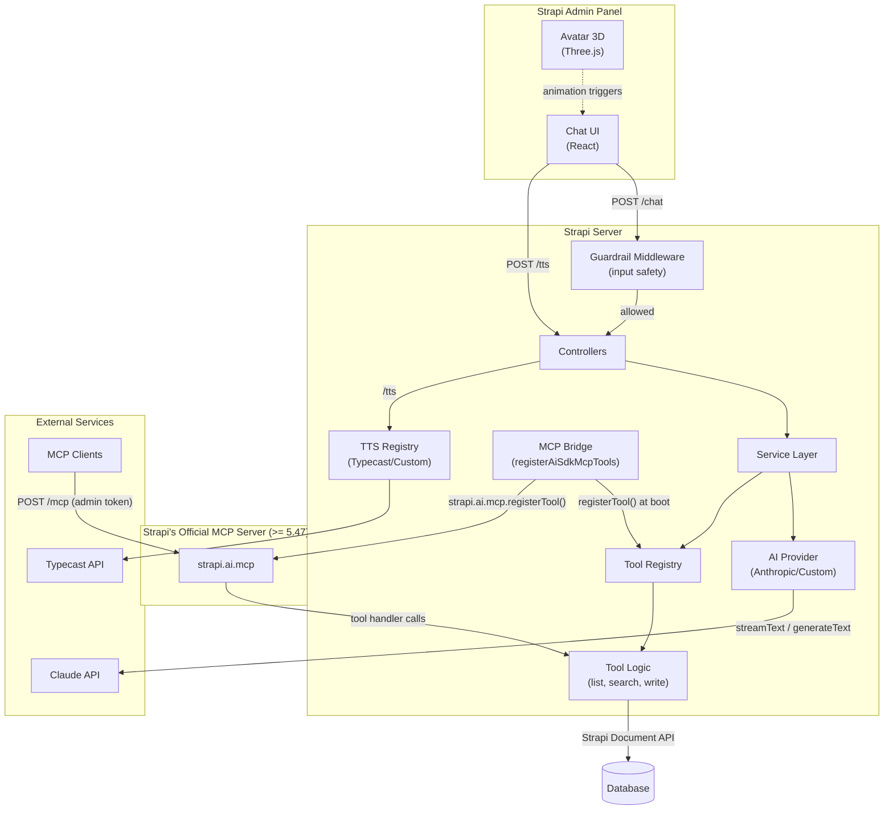
```mermaid
graph TB
    subgraph Admin["Strapi Admin Panel"]
        UI["Chat UI<br/>(React)"]
        Avatar["Avatar 3D<br/>(Three.js)"]
    end

    subgraph Server["Strapi Server"]
        Guardrail["Guardrail Middleware<br/>(input safety)"]
        Controller["Controllers"]
        Service["Service Layer"]
        AIProvider["AI Provider<br/>(Anthropic/Custom)"]
        ToolReg["Tool Registry"]
        MCPBridge["MCP Bridge<br/>(registerAiSdkMcpTools)"]
        TTS["TTS Registry<br/>(Typecast/Custom)"]
        ToolLogic["Tool Logic<br/>(list, search, write)"]
    end

    subgraph StrapiMCP["Strapi's Official MCP Server (>= 5.47)"]
        MCPServerCore["strapi.ai.mcp"]
    end

    subgraph External["External Services"]
        Claude["Claude API"]
        TypecastAPI["Typecast API"]
        MCPClient["MCP Clients"]
    end

    UI -->|"POST /chat"| Guardrail
    UI -->|"POST /tts"| Controller
    Guardrail -->|"allowed"| Controller
    Controller --> Service
    Service --> AIProvider
    Service --> ToolReg
    AIProvider -->|"streamText / generateText"| Claude
    ToolReg --> ToolLogic
    ToolLogic -->|"Strapi Document API"| DB[(Database)]
    Controller -->|"/tts"| TTS
    TTS --> TypecastAPI
    MCPBridge -->|"registerTool() at boot"| ToolReg
    MCPBridge -->|"strapi.ai.mcp.registerTool()"| MCPServerCore
    MCPClient -->|"POST /mcp (admin token)"| MCPServerCore
    MCPServerCore -->|"tool handler calls"| ToolLogic
    Avatar -.->|"animation triggers"| UI
```

Note: MCP requests to `/mcp` do **not** pass through the guardrail middleware — that route belongs to Strapi's own MCP service, not to this plugin's routes. Guardrails cover `/ask`, `/ask-stream`, and `/chat`, plus the anonymous route in `strapi-plugin-ai-sdk-public-chat`, which borrows the same middleware — see [`docs/guardrails.md`](./guardrails.md#overview).

---

## System Architecture

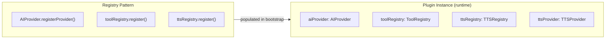
```mermaid
graph LR
    subgraph Plugin["Plugin Instance (runtime)"]
        direction TB
        AI["aiProvider: AIProvider"]
        TR["toolRegistry: ToolRegistry"]
        TTSR["ttsRegistry: TTSRegistry"]
        TTSP["ttsProvider: TTSProvider"]
    end

    subgraph Registries["Registry Pattern"]
        direction TB
        AIReg["AIProvider.registerProvider()"]
        ToolRegR["toolRegistry.register()"]
        TTSRegR["ttsRegistry.register()"]
    end

    Registries -->|"populated in bootstrap"| Plugin
```

The plugin stores all runtime state on the Strapi plugin instance (`strapi.plugin('ai-sdk')`), typed as `PluginInstance`:

```typescript
interface PluginInstance {
  aiProvider?: AIProvider;
  toolRegistry?: ToolRegistry;
}
```

There is no MCP-specific state on the plugin instance anymore — no factory,
no session map. The MCP bridge (`server/src/mcp/`) is a stateless boot-time
step: it reads `toolRegistry.getPublic()` once and calls
`strapi.ai.mcp.registerTool()` for each tool. All session, transport, and
connection state lives inside Strapi's own MCP service, which this plugin
never touches after registration.

---

## Plugin Lifecycle

```mermaid
sequenceDiagram
    participant Strapi
    participant Register
    participant Bootstrap
    participant Runtime
    participant Destroy

    Strapi->>Register: register()
    Note over Register: No-op (deferred to bootstrap)

    Strapi->>Bootstrap: bootstrap({ strapi })
    Bootstrap->>Bootstrap: Register AI provider factory
    Bootstrap->>Bootstrap: Initialize AIProvider
    Bootstrap->>Bootstrap: Create ToolRegistry + register built-in tools
    Bootstrap->>Bootstrap: discoverPluginTools() — scan other plugins for ai-tools services
    Bootstrap->>Bootstrap: registerAiSdkMcpTools() — bridge registry onto strapi.ai.mcp (no-op if MCP disabled/unavailable)
    Note over Bootstrap: Plugin instance fully populated

    Bootstrap->>Runtime: Plugin ready
    Note over Runtime: Handles requests...

    Strapi->>Destroy: destroy({ strapi })
    Destroy->>Destroy: aiProvider.destroy()
    Destroy->>Destroy: Null out references
```

Note: MCP tool registration must happen during `bootstrap()`, before Strapi's
MCP server starts serving — that is the window in which its capability set is
locked. There is nothing to tear down for MCP in `destroy()`; the plugin
holds no MCP-specific state (see [System Architecture](#system-architecture)).

### Bootstrap Order

The bootstrap function initializes systems in dependency order:

```typescript
// 1. Register provider factory (static, no config needed)
AIProvider.registerProvider('anthropic', ({ apiKey, baseURL }) => {
  const provider = createAnthropic({ apiKey, baseURL });
  return (modelId: string) => provider(modelId);
});

// 2. Initialize AI provider (needs config + registered factory)
const aiProvider = new AIProvider();
aiProvider.initialize(config);
plugin.aiProvider = aiProvider;

// 3. Initialize tool registry — loop over tools/definitions/
const toolRegistry = new ToolRegistry();
for (const tool of builtInTools) {
  toolRegistry.register(tool);
}
plugin.toolRegistry = toolRegistry;

// 4. Discover tools contributed by other plugins' `ai-tools` services
//    (e.g. strapi-plugin-ai-sdk-yt-transcripts) and register them into the
//    same registry with a namespace prefix.
discoverPluginTools(strapi, toolRegistry);

// 5. Bridge the registry onto Strapi's official MCP server. No-op (logs and
//    returns) if strapi.ai.mcp is absent (Strapi < 5.47) or not enabled
//    (host didn't set `mcp: { enabled: true }`).
await registerAiSdkMcpTools(strapi, toolRegistry);
```

---

## Server-Side Architecture

### Configuration

All plugin settings are defined in `config/index.ts` with sensible defaults:

```typescript
interface PluginConfig {
  anthropicApiKey: string;       // Required for AI features
  provider?: string;             // AI provider name (default: 'anthropic')
  chatModel?: string;            // Model ID (default: 'claude-sonnet-5')
  baseURL?: string;              // Custom API base URL
  systemPrompt?: string;         // Custom system prompt (supports {tools} placeholder)
  typecastApiKey?: string;       // For TTS
  typecastActorId?: string;      // For TTS
  guardrails?: GuardrailConfig;  // Input safety guardrails
}
```

There is no plugin-level MCP configuration anymore. MCP is enabled entirely
by the host app (`mcp: { enabled: true }` in the host's own
`config/server.ts` — a Strapi-level setting, not an `ai-sdk` plugin-config
key), and this plugin has no session/transport knobs left to tune since it
no longer owns the transport. See [MCP Server](#mcp-server) below.

Configure in your Strapi `config/plugins.ts`:

```typescript
export default {
  'ai-sdk': {
    enabled: true,
    config: {
      anthropicApiKey: env('ANTHROPIC_API_KEY'),
      chatModel: 'claude-sonnet-5',
      systemPrompt: 'You are a helpful CMS assistant.\n\n{tools}',
    },
  },
};
```

---

### Guardrails Middleware

The guardrail middleware intercepts AI requests before they reach the controller. It runs as a Strapi route middleware registered on `/ask`, `/ask-stream`, and `/chat`. `strapi-plugin-ai-sdk-public-chat` references the same middleware as `plugin::ai-sdk.guardrail` on its own route, so the anonymous surface is still screened after being split out — labelled `route: 'public-chat'`, matched on the `/ai-sdk-public-chat/` path segment. It does **not** run on `/mcp` — that route is owned by Strapi's own MCP service, not by this plugin, so MCP tool calls bypass the guardrail middleware entirely — see [`docs/guardrails.md`](./guardrails.md#overview) for the full explanation.

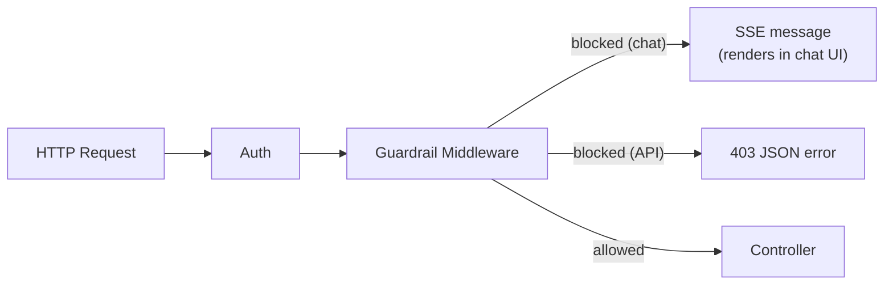
```mermaid
graph LR
    Request["HTTP Request"] --> Auth["Auth"]
    Auth --> Guardrail["Guardrail Middleware"]
    Guardrail -->|"blocked (chat)"| SSE["SSE message<br/>(renders in chat UI)"]
    Guardrail -->|"blocked (API)"| JSON["403 JSON error"]
    Guardrail -->|"allowed"| Controller["Controller"]
```

**Pipeline steps (per request):**

1. **Extract input** -- adapts to request shape (`messages[]` for any `/chat` path, `prompt` for `/ask` and `/ask-stream`)
2. **Custom hook** -- `beforeProcess` runs first (if configured)
3. **Normalize** -- NFKC, strip zero-width chars, collapse whitespace
4. **Pattern match** -- regex patterns from `default-patterns.json` + user config
5. **Length check** -- reject if over `maxInputLength` (default: 10,000)

Patterns are compiled once at startup, not per-request. The middleware produces route-aware responses: chat routes get an SSE stream (so the UI renders a natural assistant message), while API routes get a structured 403 JSON error.

**Default pattern categories:** prompt injection, jailbreak, system prompt extraction, system prompt mimicry, destructive commands.

For full details, configuration examples, and the `beforeProcess` hook API, see [docs/guardrails.md](./guardrails.md).

---

### AI Provider Factory

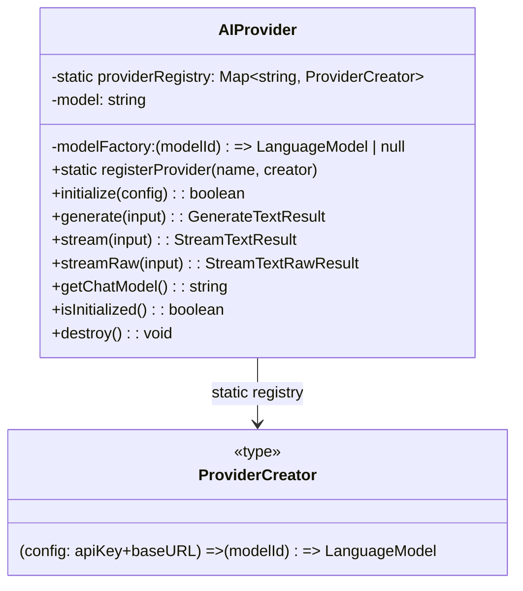
```mermaid
classDiagram
    class AIProvider {
        -static providerRegistry: Map~string, ProviderCreator~
        -modelFactory: (modelId) => LanguageModel | null
        -model: string
        +static registerProvider(name, creator)
        +initialize(config): boolean
        +generate(input): GenerateTextResult
        +stream(input): StreamTextResult
        +streamRaw(input): StreamTextRawResult
        +getChatModel(): string
        +isInitialized(): boolean
        +destroy(): void
    }

    class ProviderCreator {
        <<type>>
        (config: apiKey+baseURL) => (modelId) => LanguageModel
    }

    AIProvider --> ProviderCreator : static registry
```

The `AIProvider` uses a **static registry** for provider factories and **instance state** for the active model:

```typescript
// Registration (in bootstrap, before initialize)
AIProvider.registerProvider('anthropic', ({ apiKey, baseURL }) => {
  const provider = createAnthropic({ apiKey, baseURL });
  return (modelId: string) => provider(modelId);
});

// Initialization (reads provider name from config)
const aiProvider = new AIProvider();
aiProvider.initialize(config); // looks up config.provider ?? 'anthropic'
```

**Adding a custom provider** (e.g., OpenAI):

```typescript
import { createOpenAI } from '@ai-sdk/openai';

AIProvider.registerProvider('openai', ({ apiKey, baseURL }) => {
  const provider = createOpenAI({ apiKey, baseURL });
  return (modelId: string) => provider(modelId);
});
```

Then set `provider: 'openai'` and `chatModel: 'gpt-4o'` in config.

---

### Tool Registry

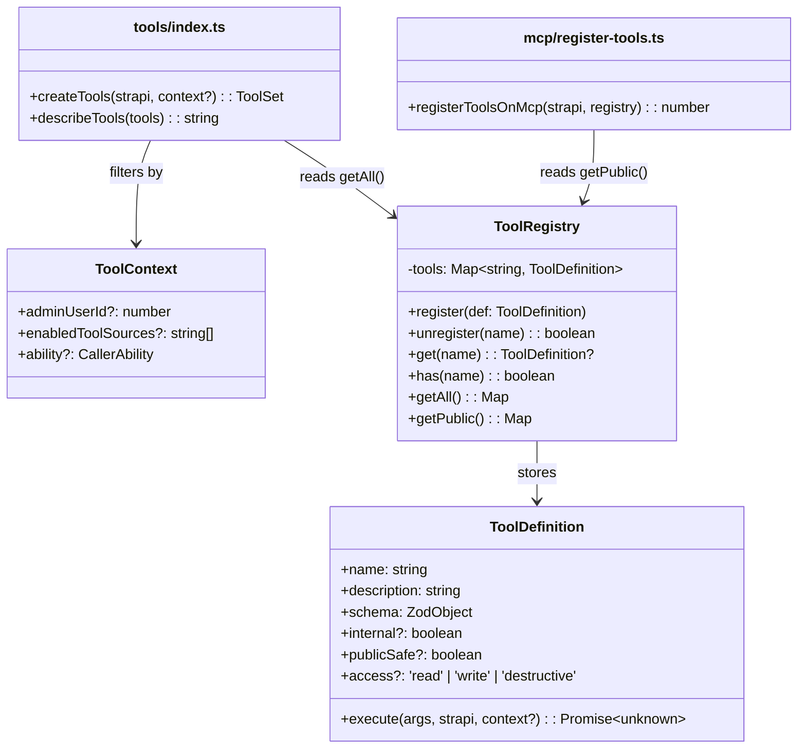
```mermaid
classDiagram
    class ToolRegistry {
        -tools: Map~string, ToolDefinition~
        +register(def: ToolDefinition)
        +unregister(name): boolean
        +get(name): ToolDefinition?
        +has(name): boolean
        +getAll(): Map
        +getPublic(): Map
    }

    class ToolDefinition {
        +name: string
        +description: string
        +schema: ZodObject
        +execute(args, strapi, context?): Promise~unknown~
        +internal?: boolean
        +publicSafe?: boolean
        +access?: 'read' | 'write' | 'destructive'
    }

    class ToolContext {
        +adminUserId?: number
        +enabledToolSources?: string[]
        +ability?: CallerAbility
    }

    AISDKTools --> ToolContext : filters by

    ToolRegistry --> ToolDefinition : stores

    class AISDKTools["tools/index.ts"] {
        +createTools(strapi, context?): ToolSet
        +describeTools(tools): string
    }

    class MCPBridge["mcp/register-tools.ts"] {
        +registerToolsOnMcp(strapi, registry): number
    }

    AISDKTools --> ToolRegistry : reads getAll()
    MCPBridge --> ToolRegistry : reads getPublic()
```

The `ToolRegistry` is the central source of truth for all tools. Two consumers read from it:

| Consumer | Method | Tools Included |
|----------|--------|----------------|
| `tools/index.ts` (AI SDK chat) | `getAll()` | Non-internal tools the **caller's role** grants, plus `internal: true` tools |
| `mcp/register-tools.ts` (MCP bridge, boot-time only) | `getPublic()` | Only non-internal tools; each gated per-tool at request time |

Both consumers ultimately enforce the **same per-tool actions** — see
[The Permission Model](#the-permission-model) below. The registry itself is
permission-agnostic; filtering happens in the consumers.

**A sample of built-in tools** (see [`docs/plugin-contract.md`](./plugin-contract.md#3-the-tooldefinition-interface) for the full list):

| Name | Internal | `access` (risk metadata) | Description |
|------|----------|--------------------------|-------------|
| `listContentTypes` | No | read (`publicSafe`) | List all Strapi content types and components |
| `searchContent` | No | read (`publicSafe`) | Search/query any content type |
| `createContent` | No | write (default) | Create a new document |
| `sendEmail` | No | destructive (explicit) | Send an email via the configured provider |
| `saveMemory` | Yes | — (chat-only, never reaches MCP) | Save a chat memory |

> **`access` no longer grants anything.** It used to select one of three
> coarse tier actions (`mcp.read`/`.write`/`.destructive`). Permissions are
> now **one action per tool**, so `access` survives purely as risk metadata —
> useful for sorting and for deciding what to tick, but it no longer decides
> what a caller may call. `tierFor()` is retained for the same reason.

**Tool name conversion for MCP:**

The MCP server converts camelCase tool names to snake_case:
- `listContentTypes` -> `list_content_types`
- `searchContent` -> `search_content`
- `createContent` -> `create_content`
- Namespaced tools also convert their `__` separator and hyphens:
  `ai-sdk-yt-transcripts__fetchTranscript` -> `ai_sdk_yt_transcripts__fetch_transcript`

---

### The Permission Model

The plugin exposes tools to two audiences that must be scoped independently:
an **admin using chat inside Strapi** (bring-your-own model, potentially
running locally) and an **external MCP client** holding an API token. The
whole point is that these need not be the same — your internal model can be
powerful while an outward-facing token stays narrow.

Both are enforced with **one action registry**. What differs is who you grant
the actions to:

| | Audience | Granted on | Enforced in |
|---|---|---|---|
| **Internal chat** | Logged-in admin user | **RBAC role** (Settings → Roles) | `createTools()` filters by `ctx.state.userAbility` |
| **External MCP** | Admin API token | **The token** (Settings → Admin Tokens) | Strapi checks each tool's `auth.policies` |

This works because both of Strapi's admin auth strategies put a CASL ability
on the same place — `ctx.state.userAbility` — the session strategy from the
user's role, the `admin-token` strategy from the token's permission list. One
check covers both callers.

**Action id shape:**

```
plugin::<owning-plugin>.tool.<slug>

plugin::ai-sdk.tool.search-content
plugin::ai-sdk-yt-transcripts.tool.fetch-transcript
```

The owning plugin is `ai-sdk` for built-ins and the contributing plugin's id
for tools discovered from other plugins — so **a plugin's tool permissions
appear under that plugin's own section** in the roles grid, not buried under
ai-sdk. `ai-sdk` discovers the tools; the owning plugin owns the permissions.

> **Two slug rules, deliberately.** The permission uid uses **hyphens**
> (`tool.fetch-transcript`) because Strapi's uid validator rejects
> underscores. The MCP wire name uses **underscores**
> (`ai_sdk_yt_transcripts__fetch_transcript`). Same tool, two encodings —
> `actionForTool()` is the single place that maps between them, so never
> hand-build an action id.

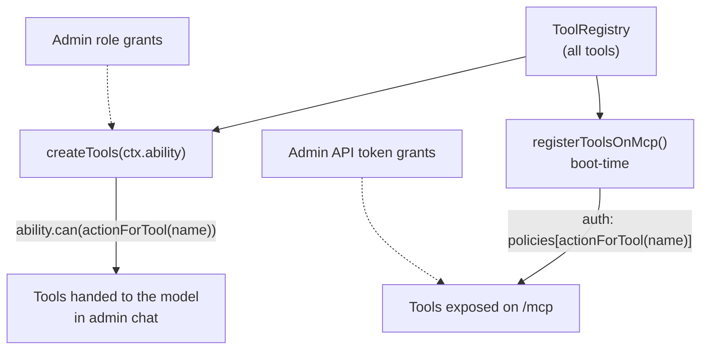
```mermaid
graph TD
    Registry["ToolRegistry<br/>(all tools)"]

    Registry --> Chat["createTools(ctx.ability)"]
    Registry --> Bridge["registerToolsOnMcp()<br/>boot-time"]

    Chat -->|"ability.can(actionForTool(name))"| ChatTools["Tools handed to the model<br/>in admin chat"]
    Bridge -->|"auth: policies[actionForTool(name)]"| MCPTools["Tools exposed on /mcp"]

    Role["Admin role grants"] -.-> Chat
    Token["Admin API token grants"] -.-> MCPTools
```

**Failure mode to know:** `createTools()` filters *only when an ability is
supplied*. Non-HTTP callers (tests, programmatic use) pass none and are
trusted with the full set. That keeps internal callers working, but it means
a new HTTP entry point that forgets to pass `ctx.state.userAbility` silently
gets **unfiltered** tools. Any new route that builds a toolset must pass the
ability through.

Anonymous traffic is outside all of this. It has no ability to check against,
so it is not served by this plugin at all — `strapi-plugin-ai-sdk-public-chat`
owns that surface, with its own routes, its own permission namespace, and an
explicit `allowedTools` list that defaults to empty. The old approach (a
`publicChat` method here, filtered by a `publicSafe` flag on each tool) failed
open: a tool missing the flag, or contributed by another plugin, widened the
anonymous surface with no config change.

---

### TTS Provider Registry

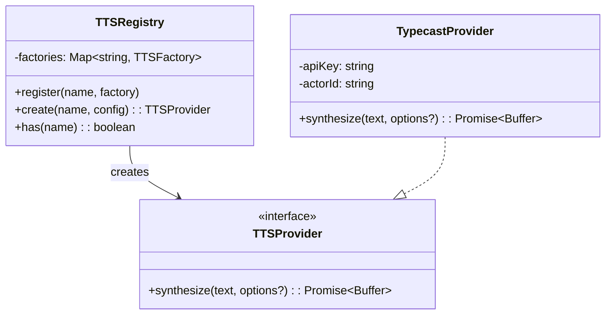
```mermaid
classDiagram
    class TTSRegistry {
        -factories: Map~string, TTSFactory~
        +register(name, factory)
        +create(name, config): TTSProvider
        +has(name): boolean
    }

    class TTSProvider {
        <<interface>>
        +synthesize(text, options?): Promise~Buffer~
    }

    class TypecastProvider {
        -apiKey: string
        -actorId: string
        +synthesize(text, options?): Promise~Buffer~
    }

    TTSRegistry --> TTSProvider : creates
    TypecastProvider ..|> TTSProvider
```

`createTTSRegistry()` returns a registry pre-loaded with the `'typecast'` factory. Additional providers can be registered at runtime.

---

### Tool Logic Layer

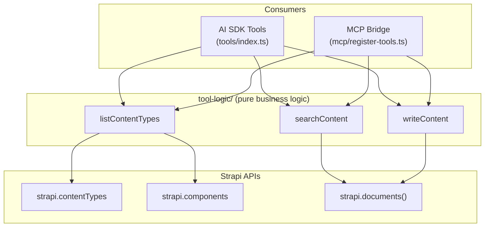
```mermaid
graph TB
    subgraph Consumers
        AITool["AI SDK Tools<br/>(tools/index.ts)"]
        MCPTool["MCP Bridge<br/>(mcp/register-tools.ts)"]
    end

    subgraph ToolLogic["tool-logic/ (pure business logic)"]
        LCT["listContentTypes"]
        SC["searchContent"]
        WC["writeContent"]
    end

    subgraph Strapi["Strapi APIs"]
        CT["strapi.contentTypes"]
        Comp["strapi.components"]
        Docs["strapi.documents()"]
    end

    AITool --> LCT
    AITool --> SC
    AITool --> WC
    MCPTool --> LCT
    MCPTool --> SC
    MCPTool --> WC
    LCT --> CT
    LCT --> Comp
    SC --> Docs
    WC --> Docs
```

The `tool-logic/` directory contains pure Strapi-coupled business logic with **no HTTP concerns**. Each module exports:
- A **Zod schema** for input validation
- A **description** string
- An **async function** that takes `(strapi, params?)` and returns results

This layer is shared between AI SDK tools and MCP tools, ensuring consistent behavior.

---

### Services

The service layer (`services/service.ts`) is the facade between controllers and `AIProvider`:

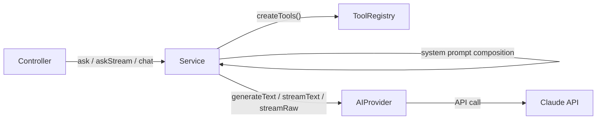
```mermaid
graph LR
    Controller -->|"ask / askStream / chat"| Service
    Service -->|"system prompt composition"| Service
    Service -->|"createTools()"| ToolRegistry
    Service -->|"generateText / streamText / streamRaw"| AIProvider
    AIProvider -->|"API call"| Claude["Claude API"]
```

**System prompt composition** is handled entirely by the service:

```typescript
function composeSystemPrompt(config, toolsDescription, override?) {
  const base = override || config?.systemPrompt || DEFAULT_PREAMBLE;

  // Support {tools} placeholder
  if (base.includes('{tools}')) {
    return base.replace('{tools}', toolsDescription);
  }

  // Otherwise append tool descriptions
  return `${base}\n\n${toolsDescription}`;
}
```

The default preamble is:
> "You are a Strapi CMS assistant. Use your tools to fulfill user requests. When asked to create or update content, use the appropriate tool -- do not tell the user you cannot."

---

### Controllers & Routes

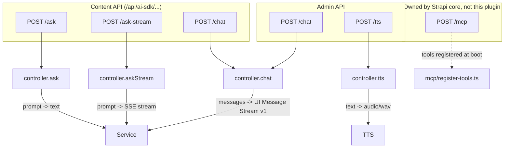
```mermaid
graph TB
    subgraph ContentAPI["Content API (/api/ai-sdk/...)"]
        R1["POST /ask"]
        R2["POST /ask-stream"]
        R3["POST /chat"]
    end

    subgraph AdminAPI["Admin API"]
        R5["POST /chat"]
        R6["POST /tts"]
    end

    subgraph StrapiOwned["Owned by Strapi core, not this plugin"]
        R4["POST /mcp"]
    end

    R1 --> C1["controller.ask"]
    R2 --> C2["controller.askStream"]
    R3 --> C3["controller.chat"]
    R5 --> C3
    R6 --> C5["controller.tts"]
    R4 -.->|"tools registered at boot"| MCPBridge["mcp/register-tools.ts"]

    C1 -->|"prompt -> text"| Service
    C2 -->|"prompt -> SSE stream"| Service
    C3 -->|"messages -> UI Message Stream v1"| Service
    C5 -->|"text -> audio/wav"| TTS
```

| Endpoint | Type | Handler | Description |
|----------|------|---------|-------------|
| `POST /ask` | Content API | `controller.ask` | Simple prompt -> text response |
| `POST /ask-stream` | Content API | `controller.askStream` | Prompt -> SSE text stream |
| `POST /chat` | Content API + Admin | `controller.chat` | Messages -> UI Message Stream v1 |
| `POST /tts` | Admin only | `controller.tts` | Text -> audio/wav buffer |
| `POST /mcp` (+ SSE/session semantics) | Strapi core, not this plugin | `strapi.ai.mcp` | JSON-RPC/MCP protocol, admin-token authenticated |

This plugin has **no `/mcp` route of its own** anymore — no route file entry,
no controller. It only *populates* `/mcp`'s capability set at boot, by
calling `strapi.ai.mcp.registerTool()` for each public tool.

---

### MCP Server

```mermaid
sequenceDiagram
    participant Boot as bootstrap()
    participant Registry as ToolRegistry
    participant Bridge as registerAiSdkMcpTools()
    participant Perms as admin::permission
    participant MCP as strapi.ai.mcp
    participant Client as MCP Client
    participant Tools as Tool Logic

    Boot->>Registry: built-in tools + discoverPluginTools()
    Boot->>Bridge: registerAiSdkMcpTools(strapi, registry)
    Bridge->>MCP: isEnabled()?
    alt Strapi < 5.47 or mcp.enabled !== true
        Bridge-->>Boot: log + return (no tools registered)
    else enabled
        Bridge->>Perms: registerMany(one action per tool, grouped by owning plugin)
        loop for each registry.getPublic() tool
            Bridge->>Bridge: toSnakeCase(name), actionForTool(name)
            Bridge->>MCP: registerTool({ name, schema, auth: {policies:[toolAction]}, handler })
            Note over Bridge: try/catch per tool — one bad tool logs<br/>a warning and is skipped, boot continues
        end
        Bridge->>MCP: registerResource(strapi://ai-sdk/tools/guide)
    end

    Note over Client,MCP: Later, at request time — this plugin is no<br/>longer involved; Strapi owns transport/sessions/auth

    Client->>MCP: POST /mcp {tools/call, name, args} + Bearer admin token
    MCP->>MCP: check auth.policies action against token's role
    MCP->>Tools: registered handler → def.execute(args, strapi)
    Tools-->>MCP: result
    MCP->>MCP: guardSize() — substitute error if ~2x payload > 950KB
    MCP-->>Client: { content, structuredContent }
```

**What changed from the hand-rolled server:**
- No sessions, no `mcp-session-id` header handling, no session map, no
  expiry sweeps, no `maxSessions`/`cleanupInterval` config — all of that was
  deleted along with the old transport. Strapi's own MCP service owns
  connection lifecycle now; this plugin never sees an individual request.
- Tool registration is **one boot-time pass**, not per-session. Once
  `registerAiSdkMcpTools()` returns, this plugin's involvement with MCP is
  over until the next boot — `strapi.ai.mcp.registerTool()`'s `createHandler`
  closure is what actually runs on each `tools/call`.
- Authorization is `auth: { policies: [{ action }] }` per tool — **one action
  per tool** (`plugin::<owner>.tool.<slug>`), not a single blanket `handle`
  permission on the whole endpoint, and no longer the three coarse tiers the
  first migration shipped. See
  [The Permission Model](#the-permission-model).
- A `guardSize()` backstop substitutes a structured "too large, paginate"
  error for any result whose doubled wire size (content + structuredContent)
  would exceed ~1&nbsp;MB, since MCP clients reject oversized results with an
  opaque, unactionable error.

**Failure isolation is two-layered** (`server/src/mcp/index.ts` and
`server/src/mcp/register-tools.ts`):
- **Inner layer (per tool):** the note in the diagram above — each tool's
  `mcp.registerTool()` call is individually wrapped in try/catch inside
  `registerToolsOnMcp()`'s loop. One tool's registration failing (e.g. a name
  collision with a Strapi-derived built-in) logs a warning and skips just
  that tool; the loop continues to the next one.
- **Outer layer (whole pass):** `registerAiSdkMcpTools()` wraps
  `registerMcpAdminPermissions()`, `registerToolsOnMcp()`, and
  `registerResourcesOnMcp()` in a single try/catch. If anything in that
  block throws unexpectedly — e.g. the admin permission service throws, or
  resource registration fails — it's caught, logged at `strapi.log.error`,
  and **not rethrown**. `bootstrap()` returns normally and Strapi finishes
  booting successfully; only MCP capability registration is affected, never
  the rest of the plugin or the host app. This outer catch is **not
  transactional**: if the tool-registration loop already called
  `mcp.registerTool()` for some tools before a later step throws (e.g.
  `registerResourcesOnMcp()` fails after tools succeeded), those
  already-registered tools stay registered — the catch only stops whatever
  ran after the throw point, it doesn't undo prior side effects.

---

## Admin-Side Architecture

### Component Tree

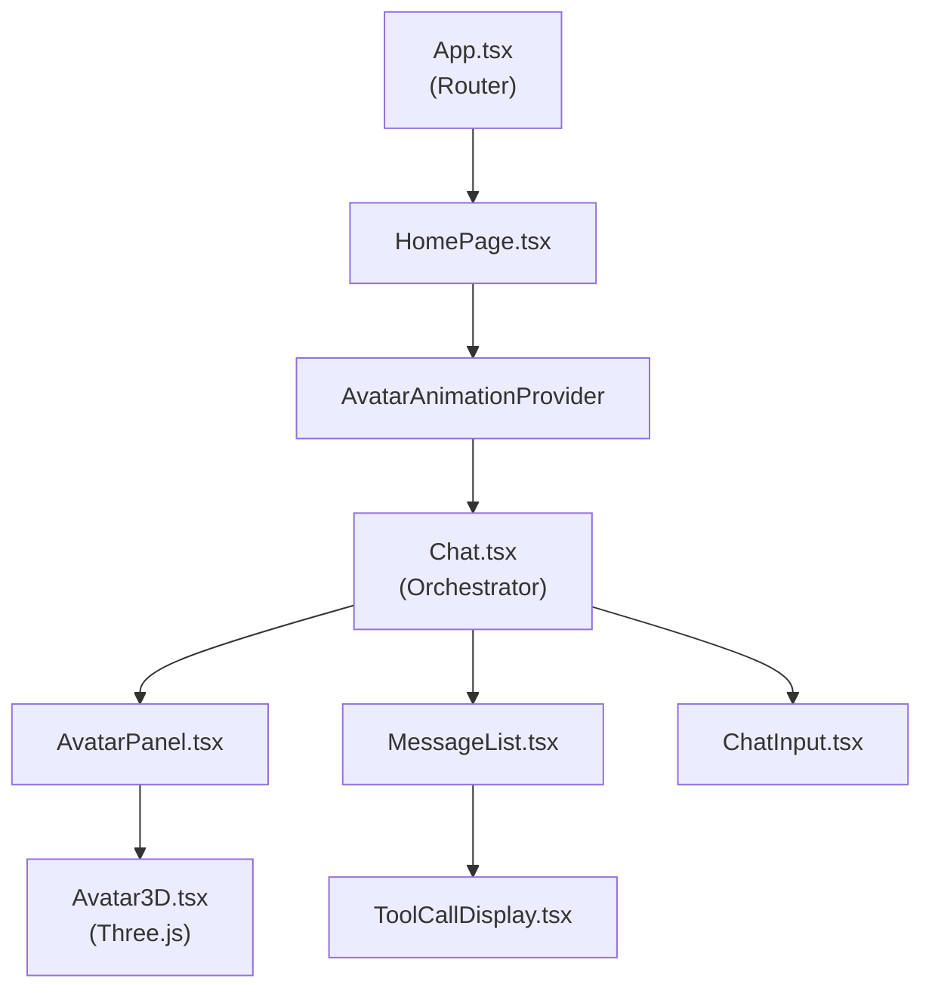
```mermaid
graph TB
    App["App.tsx<br/>(Router)"]
    HomePage["HomePage.tsx"]
    Provider["AvatarAnimationProvider"]
    Chat["Chat.tsx<br/>(Orchestrator)"]
    AvatarPanel["AvatarPanel.tsx"]
    Avatar3D["Avatar3D.tsx<br/>(Three.js)"]
    MessageList["MessageList.tsx"]
    ChatInput["ChatInput.tsx"]
    ToolCallDisplay["ToolCallDisplay.tsx"]

    App --> HomePage
    HomePage --> Provider
    Provider --> Chat
    Chat --> AvatarPanel
    Chat --> MessageList
    Chat --> ChatInput
    AvatarPanel --> Avatar3D
    MessageList --> ToolCallDisplay
```

### Chat Component Split

The Chat UI is split into focused components, each with co-located styled-components:

| Component | Responsibility | Lines |
|-----------|---------------|-------|
| `Chat.tsx` | Orchestrator -- wires hooks to subcomponents | ~100 |
| `MessageList.tsx` | Message rendering loop, typing indicator, markdown | ~130 |
| `ChatInput.tsx` | Input field, voice toggle, send button | ~90 |
| `ToolCallDisplay.tsx` | Collapsible tool call viewer | ~70 |

**Chat.tsx** manages all state and passes props down:

```typescript
export function Chat() {
  // State
  const [input, setInput] = useState('');
  const [voiceEnabled, setVoiceEnabled] = useState(false);
  const [awaitingAudio, setAwaitingAudio] = useState(false);

  // Hooks
  const { trigger, clearAnimation } = useAvatarAnimation();
  const { visibleText, startReveal, reset: resetReveal } = useTextReveal();
  const { speak, stop: stopAudio } = useAudioPlayer({ onPlayStart, onPlayEnded });
  const { messages, sendMessage, isLoading, error } = useChat({ onAnimationTrigger, onStreamEnd });

  return (
    <ChatLayout>
      <AvatarPanel />
      <ChatWrapper>
        <MessageList
          ref={messagesEndRef}
          messages={messages}
          isLoading={isLoading}
          awaitingAudio={awaitingAudio}
          voiceEnabled={voiceEnabled}
          visibleText={visibleText}
        />
        {error && <ErrorBox />}
        <ChatInput
          input={input}
          isLoading={isLoading}
          voiceEnabled={voiceEnabled}
          onInputChange={setInput}
          onSend={handleSend}
          onToggleVoice={handleToggleVoice}
        />
      </ChatWrapper>
    </ChatLayout>
  );
}
```

---

### Hooks

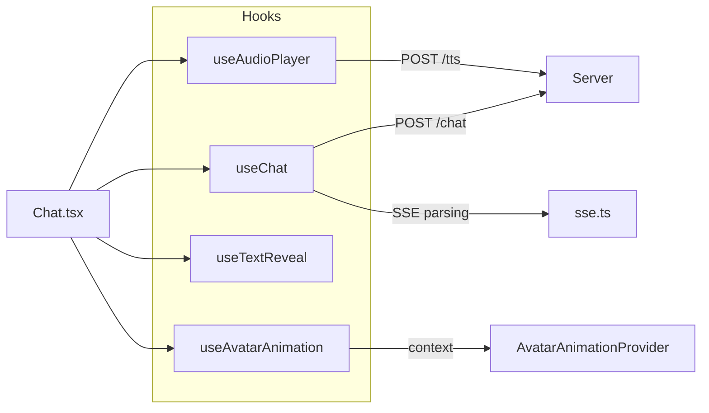
```mermaid
graph LR
    subgraph Hooks
        UC["useChat"]
        UAP["useAudioPlayer"]
        UTR["useTextReveal"]
        UAA["useAvatarAnimation"]
    end

    Chat["Chat.tsx"] --> UC
    Chat --> UAP
    Chat --> UTR
    Chat --> UAA

    UC -->|"POST /chat"| Server
    UC -->|"SSE parsing"| SSEUtils["sse.ts"]
    UAP -->|"POST /tts"| Server
    UAA -->|"context"| AvatarProvider["AvatarAnimationProvider"]
```

| Hook | Purpose | Key Returns |
|------|---------|-------------|
| `useChat` | Message state, SSE streaming, tool call tracking | `messages`, `sendMessage`, `isLoading`, `error` |
| `useAudioPlayer` | TTS fetch, Audio playback | `speak(text)`, `stop()`, `isPlaying` |
| `useTextReveal` | Progressive text reveal synced to audio duration | `visibleText`, `startReveal(text, duration)`, `reset()` |
| `useAvatarAnimation` | Context consumer for animation triggers | `trigger(name)`, `clearAnimation()` |

**SSE Protocol (UI Message Stream v1):**

The `sse.ts` utility parses the AI SDK streaming format:

| Event Type | Data | Usage |
|------------|------|-------|
| `text-delta` | `{ delta: string }` | Accumulated into message content |
| `tool-input-available` | `{ toolCallId, toolName, input }` | Added to message's toolCalls array |
| `tool-output-available` | `{ toolCallId, output }` | Updates toolCalls output field |

---

### Avatar 3D System

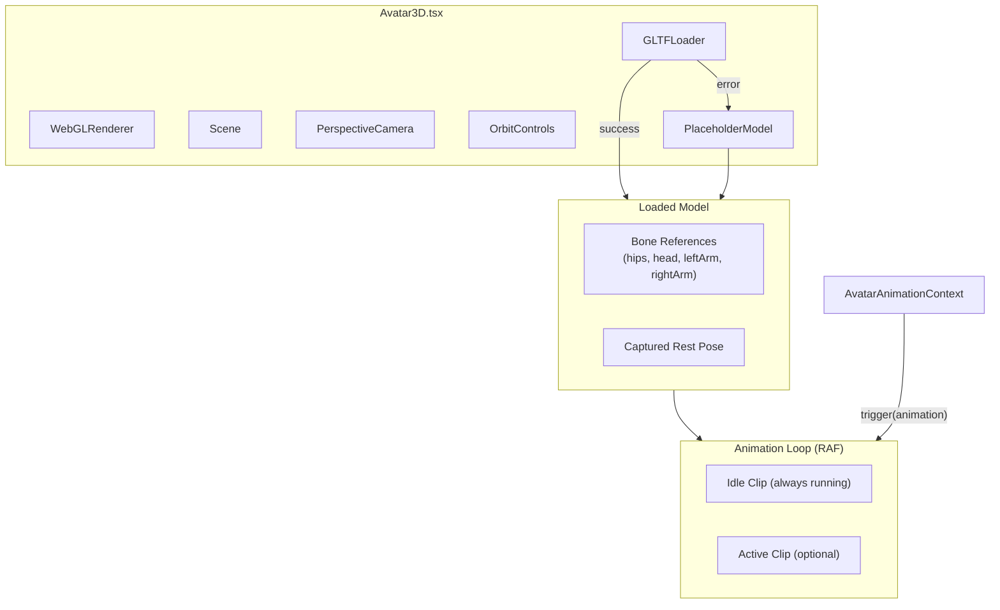
```mermaid
graph TB
    subgraph Avatar3D["Avatar3D.tsx"]
        Renderer["WebGLRenderer"]
        Scene["Scene"]
        Camera["PerspectiveCamera"]
        Controls["OrbitControls"]
        GLBLoader["GLTFLoader"]
        Fallback["PlaceholderModel"]
    end

    subgraph Model["Loaded Model"]
        Bones["Bone References<br/>(hips, head, leftArm, rightArm)"]
        RestPose["Captured Rest Pose"]
    end

    subgraph AnimLoop["Animation Loop (RAF)"]
        IdleClip["Idle Clip (always running)"]
        ActiveClip["Active Clip (optional)"]
    end

    GLBLoader -->|"success"| Model
    GLBLoader -->|"error"| Fallback
    Fallback --> Model
    Model --> AnimLoop
    AvatarContext["AvatarAnimationContext"] -->|"trigger(animation)"| AnimLoop
```

**Custom Avatar Model (optional):**

The plugin includes a built-in procedural avatar that works out of the box. To use a custom `.glb` model instead:

1. Place your `.glb` file at `<strapi-project>/public/models/avatar.glb`
2. Restart Strapi

The plugin will automatically detect and load it. If the file is missing, you'll see a console message and the built-in avatar is used. To always use the built-in avatar, set `MODEL_PATH = null` in `Avatar3D.tsx`.

**Why raw Three.js instead of React Three Fiber?**

R3F's custom React reconciler is incompatible with Strapi's React 18 runtime (even R3F v8). It causes `Cannot read properties of undefined (reading 'S')` at runtime. The plugin uses imperative Three.js with `useRef`/`useEffect` instead.

---

### Animation System

All animations are **procedural** (no keyframe files) and **additive** (layered on top of the rest pose):

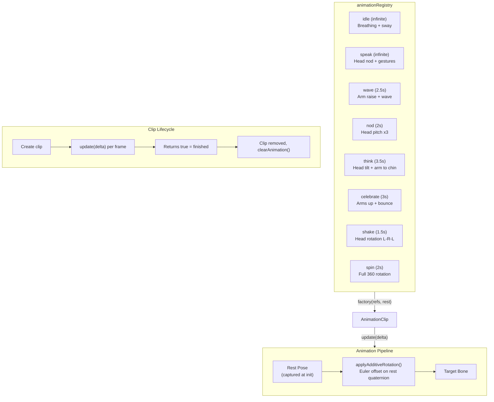
```mermaid
graph TB
    subgraph Registry["animationRegistry"]
        idle["idle (infinite)<br/>Breathing + sway"]
        speak["speak (infinite)<br/>Head nod + gestures"]
        wave["wave (2.5s)<br/>Arm raise + wave"]
        nod["nod (2s)<br/>Head pitch x3"]
        think["think (3.5s)<br/>Head tilt + arm to chin"]
        celebrate["celebrate (3s)<br/>Arms up + bounce"]
        shake["shake (1.5s)<br/>Head rotation L-R-L"]
        spin["spin (2s)<br/>Full 360 rotation"]
    end

    subgraph Pipeline["Animation Pipeline"]
        RestPose["Rest Pose<br/>(captured at init)"]
        Additive["applyAdditiveRotation()<br/>Euler offset on rest quaternion"]
        Bone["Target Bone"]
    end

    Registry -->|"factory(refs, rest)"| Clip["AnimationClip"]
    Clip -->|"update(delta)"| Pipeline
    RestPose --> Additive
    Additive --> Bone

    subgraph Lifecycle["Clip Lifecycle"]
        Create["Create clip"]
        Update["update(delta) per frame"]
        Done["Returns true = finished"]
        Remove["Clip removed, clearAnimation()"]
    end

    Create --> Update --> Done --> Remove
```

The **idle** animation runs perpetually as the background layer. When a named animation is triggered, it creates an **active clip** that runs on top of idle. When the active clip's `update()` returns `true`, it's removed and `clearAnimation()` resets to idle.

---

## Data Flows

### Chat Request Flow

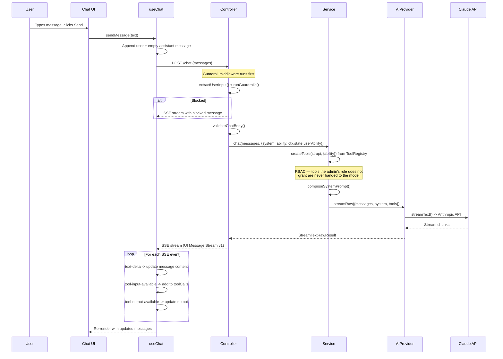
```mermaid
sequenceDiagram
    participant User
    participant ChatUI as Chat UI
    participant useChat
    participant Controller
    participant Service
    participant AIProvider
    participant Claude as Claude API

    User->>ChatUI: Types message, clicks Send
    ChatUI->>useChat: sendMessage(text)
    useChat->>useChat: Append user + empty assistant message
    useChat->>Controller: POST /chat {messages}

    Note over Controller: Guardrail middleware runs first
    Controller->>Controller: extractUserInput() + runGuardrails()
    alt Blocked
        Controller-->>useChat: SSE stream with blocked message
    end

    Controller->>Controller: validateChatBody()
    Controller->>Service: chat(messages, {system, ability: ctx.state.userAbility})
    Service->>Service: createTools(strapi, {ability}) from ToolRegistry
    Note over Service: RBAC — tools the admin's role does not<br/>grant are never handed to the model
    Service->>Service: composeSystemPrompt()
    Service->>AIProvider: streamRaw({messages, system, tools})
    AIProvider->>Claude: streamText() -> Anthropic API
    Claude-->>AIProvider: Stream chunks
    AIProvider-->>Controller: StreamTextRawResult
    Controller-->>useChat: SSE stream (UI Message Stream v1)

    loop For each SSE event
        useChat->>useChat: text-delta -> update message content
        useChat->>useChat: tool-input-available -> add to toolCalls
        useChat->>useChat: tool-output-available -> update output
    end

    useChat-->>ChatUI: Re-render with updated messages
```

### MCP Request Flow

This plugin does not handle individual MCP requests at all anymore — Strapi's
own MCP service owns the request path end to end. The only thing this plugin
contributes at request time is the `createHandler` closure it registered at
boot for each tool. See [MCP Server](#mcp-server)
above for the full boot-time registration sequence and the request-time
handler path.

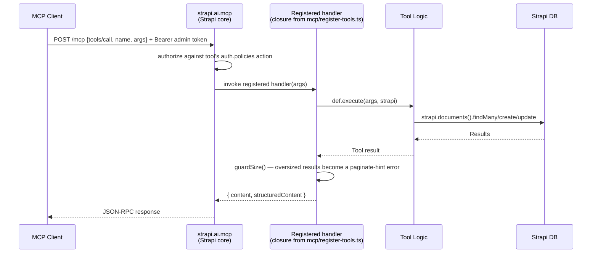
```mermaid
sequenceDiagram
    participant Client as MCP Client
    participant MCP as strapi.ai.mcp<br/>(Strapi core)
    participant Handler as Registered handler<br/>(closure from mcp/register-tools.ts)
    participant Logic as Tool Logic
    participant DB as Strapi DB

    Client->>MCP: POST /mcp {tools/call, name, args} + Bearer admin token
    MCP->>MCP: authorize against tool's auth.policies action
    MCP->>Handler: invoke registered handler(args)
    Handler->>Logic: def.execute(args, strapi)
    Logic->>DB: strapi.documents().findMany/create/update
    DB-->>Logic: Results
    Logic-->>Handler: Tool result
    Handler->>Handler: guardSize() — oversized results become a paginate-hint error
    Handler-->>MCP: { content, structuredContent }
    MCP-->>Client: JSON-RPC response
```

### Voice Mode Flow

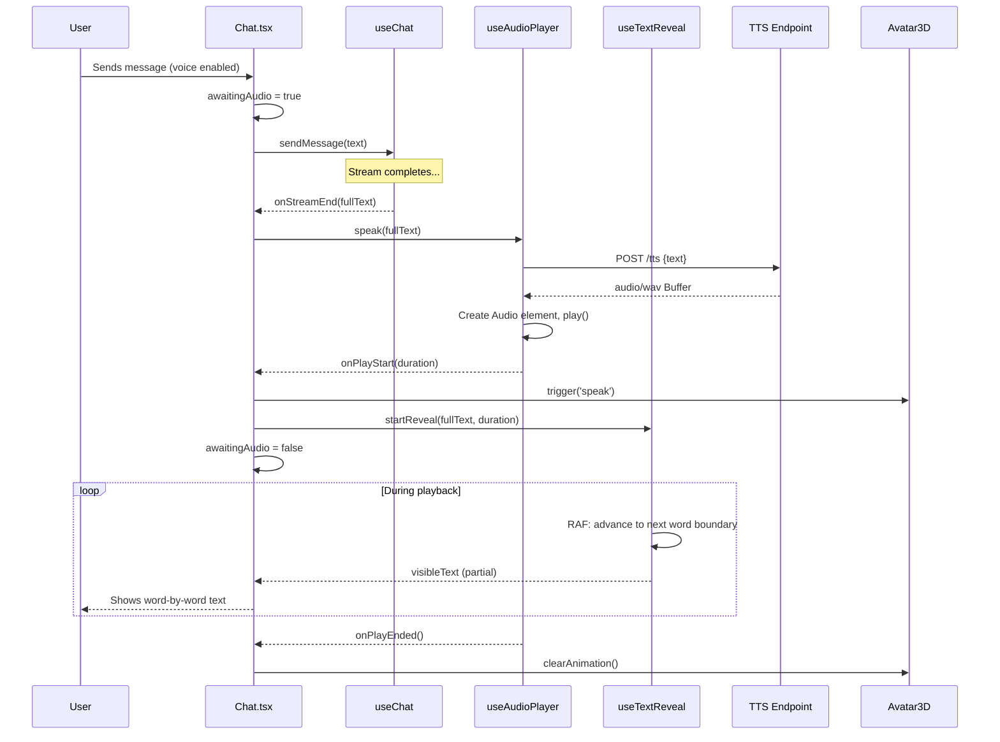
```mermaid
sequenceDiagram
    participant User
    participant Chat as Chat.tsx
    participant useChat
    participant useAudio as useAudioPlayer
    participant useReveal as useTextReveal
    participant TTS as TTS Endpoint
    participant Avatar as Avatar3D

    User->>Chat: Sends message (voice enabled)
    Chat->>Chat: awaitingAudio = true
    Chat->>useChat: sendMessage(text)

    Note over useChat: Stream completes...
    useChat-->>Chat: onStreamEnd(fullText)
    Chat->>useAudio: speak(fullText)
    useAudio->>TTS: POST /tts {text}
    TTS-->>useAudio: audio/wav Buffer
    useAudio->>useAudio: Create Audio element, play()

    useAudio-->>Chat: onPlayStart(duration)
    Chat->>Avatar: trigger('speak')
    Chat->>useReveal: startReveal(fullText, duration)
    Chat->>Chat: awaitingAudio = false

    loop During playback
        useReveal->>useReveal: RAF: advance to next word boundary
        useReveal-->>Chat: visibleText (partial)
        Chat-->>User: Shows word-by-word text
    end

    useAudio-->>Chat: onPlayEnded()
    Chat->>Avatar: clearAnimation()
```

### Animation Flow

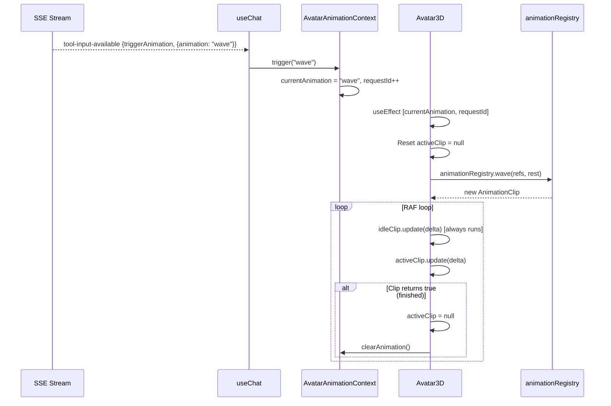
```mermaid
sequenceDiagram
    participant Stream as SSE Stream
    participant useChat
    participant Context as AvatarAnimationContext
    participant Avatar3D
    participant AnimReg as animationRegistry

    Stream-->>useChat: tool-input-available {triggerAnimation, {animation: "wave"}}
    useChat->>Context: trigger("wave")
    Context->>Context: currentAnimation = "wave", requestId++

    Avatar3D->>Avatar3D: useEffect [currentAnimation, requestId]
    Avatar3D->>Avatar3D: Reset activeClip = null
    Avatar3D->>AnimReg: animationRegistry.wave(refs, rest)
    AnimReg-->>Avatar3D: new AnimationClip

    loop RAF loop
        Avatar3D->>Avatar3D: idleClip.update(delta) [always runs]
        Avatar3D->>Avatar3D: activeClip.update(delta)
        alt Clip returns true (finished)
            Avatar3D->>Avatar3D: activeClip = null
            Avatar3D->>Context: clearAnimation()
        end
    end
```

---

## Extending the Plugin

### Adding a Custom Tool

**Option A: Add a built-in tool** (inside the plugin)

Create a new file in `tools/definitions/` and add it to the barrel:

```typescript
// tools/definitions/analyze-content.ts
import { z } from 'zod';
import type { ToolDefinition } from '../../lib/tool-registry';

export const analyzeContentTool: ToolDefinition = {
  name: 'analyzeContent',
  description: 'Analyze content quality and suggest improvements',
  schema: z.object({
    contentType: z.string().describe('Content type UID'),
    documentId: z.string().describe('Document ID to analyze'),
  }),
  execute: async (args, strapi) => {
    const doc = await strapi.documents(args.contentType).findOne({
      documentId: args.documentId,
    });
    // Your analysis logic here...
    return { score: 85, suggestions: ['Add more headings', 'Improve readability'] };
  },
  internal: false, // Set to true to hide from MCP
};
```

Then add it to the barrel in `tools/definitions/index.ts`:

```typescript
import { analyzeContentTool } from './analyze-content';

export const builtInTools: ToolDefinition[] = [
  // ...existing tools
  analyzeContentTool,
];
```

**Option B: Register at runtime** (from your Strapi app or another plugin)

```typescript
// src/index.ts (your Strapi app)
import { z } from 'zod';

export default {
  bootstrap({ strapi }) {
    const plugin = strapi.plugin('ai-sdk');
    plugin.toolRegistry.register({
      name: 'analyzeContent',
      description: 'Analyze content quality and suggest improvements',
      schema: z.object({
        contentType: z.string().describe('Content type UID'),
        documentId: z.string().describe('Document ID to analyze'),
      }),
      execute: async (args, strapi) => {
        const doc = await strapi.documents(args.contentType).findOne({
          documentId: args.documentId,
        });
        return { score: 85, suggestions: ['Add more headings'] };
      },
    });
  },
};
```

Either way, the tool is automatically available in:
- **AI Chat** (via `createTools()` which reads `getAll()`, filtered by the
  calling admin's role grants)
- **MCP** (via the boot-time bridge in `mcp/register-tools.ts`, which reads
  `getPublic()` — skipped for `internal: true` tools — and gates the tool
  behind its own `plugin::<owner>.tool.<slug>` action; see
  [`docs/plugin-contract.md`](./plugin-contract.md))

A permission action is registered for the new tool automatically, under the
**owning plugin's** section in Settings → Roles. Nothing needs to be declared
by hand. Note that the action starts **ungranted** — a brand-new tool is
invisible to every role and token until someone ticks it.

No changes to `tools/index.ts` or `mcp/register-tools.ts` needed — the bridge
picks up newly-registered tools automatically the next time Strapi boots.
MCP tool registration only happens once, at boot; a tool registered at
runtime after boot (e.g. from another plugin's `bootstrap()` running later)
will not retroactively appear on `/mcp` until the next restart.

### Adding an AI Provider

```typescript
// src/index.ts
import { createOpenAI } from '@ai-sdk/openai';
import { AIProvider } from 'ai-sdk/server';

export default {
  register({ strapi }) {
    // Register BEFORE bootstrap runs
    AIProvider.registerProvider('openai', ({ apiKey, baseURL }) => {
      const provider = createOpenAI({ apiKey, baseURL });
      return (modelId: string) => provider(modelId);
    });
  },
};
```

Then in `config/plugins.ts`:

```typescript
export default {
  'ai-sdk': {
    config: {
      anthropicApiKey: env('OPENAI_API_KEY'), // reuses same config field
      provider: 'openai',
      chatModel: 'gpt-4o',
    },
  },
};
```

### Adding a TTS Provider

```typescript
// src/index.ts
export default {
  bootstrap({ strapi }) {
    const plugin = strapi.plugin('ai-sdk');

    plugin.ttsRegistry.register('elevenlabs', (config) => ({
      async synthesize(text, options) {
        // Call ElevenLabs API...
        return audioBuffer;
      },
    }));

    // Optionally set as the active provider
    plugin.ttsProvider = plugin.ttsRegistry.create('elevenlabs', {
      apiKey: process.env.ELEVENLABS_API_KEY,
      voiceId: 'some-voice-id',
    });
  },
};
```

### Customizing the System Prompt

**Option A: Simple replacement**

```typescript
// config/plugins.ts
export default {
  'ai-sdk': {
    config: {
      systemPrompt: 'You are a friendly content editor for our blog platform.',
      // Tool descriptions will be appended automatically
    },
  },
};
```

**Option B: Using the `{tools}` placeholder**

```typescript
export default {
  'ai-sdk': {
    config: {
      systemPrompt: `You are a blog content assistant.

IMPORTANT RULES:
- Always use friendly, casual language
- Never create content without asking for confirmation first

{tools}

When listing content types, summarize them in a table format.`,
    },
  },
};
```

**Option C: Per-request override** (via API)

```bash
curl -X POST http://localhost:1337/api/ai-sdk/chat \
  -H "Content-Type: application/json" \
  -d '{
    "messages": [...],
    "system": "You are a technical documentation writer."
  }'
```

Per-request `system` takes priority over config `systemPrompt`.

### Enabling and Scoping MCP

There is no plugin-level session tuning anymore — this plugin no longer owns
the transport, so there is nothing here to configure. The only switch is on
the host application, in `config/server.ts` (not `config/plugins.ts`):

```typescript
// config/server.ts
export default ({ env }) => ({
  host: env('HOST', '0.0.0.0'),
  port: env.int('PORT', 1337),
  mcp: {
    enabled: true,
  },
});
```

Scoping which tools a given client can reach is done per **Admin API token**,
by granting that token the individual `plugin::<owner>.tool.<slug>` actions
for the tools it should see — not through plugin config. A token granted two
actions lists exactly two tools from `tools/list`; the rest are invisible to
it, not merely un-callable.

This is the external half of [The Permission Model](#the-permission-model) —
grants on a **token** scope MCP, grants on a **role** scope internal chat.
See [`docs/plugin-contract.md`](./plugin-contract.md).

---

## Testing

### Test Scripts

The plugin uses **end-to-end integration tests** that run against a live Strapi instance. No test framework is needed -- each test is a standalone script using native `fetch`.

| Script | Command | What It Tests |
|---|---|---|
| `test:api` | `npx tsx tests/ai-sdk.test.ts` | `/ask` and `/ask-stream` endpoints (valid requests, error handling) |
| `test:stream` | `node tests/test-stream.mjs` | Streaming response (visual output, chunk timing) |
| `test:chat` | `node tests/test-chat.mjs` | Chat endpoint with UI Message Stream v1 protocol |
| `test:guardrails` | `npx tsx tests/test-guardrails.ts` | All guardrail categories (42 assertions) |
| `test:ts:front` | `tsc -p admin/tsconfig.json` | Admin TypeScript type checking |
| `test:ts:back` | `tsc -p server/tsconfig.json` | Server TypeScript type checking |
| `test:e2e` | `vitest run --config vitest.e2e.config.ts tests/e2e/structural.test.ts` | MCP structural suite (vitest, not a fetch script) — tool exposure, permission-tier scoping, `.describe()` preservation, the tool-guide resource, the yt-transcripts UID coupling, no duplicate tool names. Free — no tool execution, no external API calls. |
| `test:e2e:live` | `E2E_LIVE=1 vitest run --config vitest.e2e.config.ts` | Live pipeline: fetch a real transcript, wait for embedding, semantic-search it via MCP, trigger a chat tool call. Requires real API keys and a short known video. |

Both `test:e2e` and `test:e2e:live` require a running Strapi host **>= 5.47**
with `mcp: { enabled: true }`, all three plugins (`ai-sdk`, `-yt-transcripts`,
`-yt-embeddings`) linked/installed, and `STRAPI_URL` /
`STRAPI_ADMIN_TOKEN` (an admin token granting all three
`plugin::ai-sdk.mcp.*` permissions) in the environment. **As of this
migration, neither has been run** — see
[`docs/plugin-contract.md`](./plugin-contract.md#9-e2e-suites--unverified-prerequisites)
for the full prerequisite list. Do not treat their existence as proof MCP
works end to end against a real host.

### Testing Methodology

**Why e2e scripts instead of unit tests?**

The plugin's value is in how its components work together end-to-end: middleware intercepts requests, the AI provider streams responses, tools execute against the Strapi document API, and SSE events reach the frontend. Unit tests with mocked Strapi internals would miss integration issues while adding maintenance burden. Standalone scripts with `fetch` are simple, framework-free, and test the actual request pipeline.

**Test design principles:**

- **Self-contained** -- each script runs independently, no shared state
- **Health check first** -- all scripts verify Strapi is running before testing
- **Pass/fail output** -- clear emoji indicators, exit code 1 on failure
- **Auth-aware** -- `STRAPI_TOKEN` env var for authenticated endpoints
- **Smart assertions** -- guardrail tests check response body (not just status code) to distinguish guardrail blocks from permission blocks

### Running Tests

**Prerequisites:**

1. Strapi is running (`yarn dev` in the Strapi app)
2. Plugin is built (`npm run build` in the plugin directory)
3. Content API endpoints are accessible (either public or via API token)

**Run all tests:**

```bash
# From the plugin directory
npm run test:guardrails    # Guardrail safety tests
npm run test:api           # API endpoint tests
npm run test:stream        # Streaming visual test
npm run test:chat          # Chat protocol test
```

**With authentication:**

```bash
STRAPI_TOKEN=your-api-token npm run test:guardrails
```

**Type checking only (no running Strapi needed):**

```bash
npm run test:ts:back
npm run test:ts:front
```

---

## File Reference

```
server/src/
  index.ts                          # Server entry point (assembles all modules)
  register.ts                       # No-op register lifecycle
  bootstrap.ts                      # Initialize all registries and providers
  destroy.ts                        # Graceful shutdown
  config/
    index.ts                        # Plugin config defaults and validator
  guardrails/
    default-patterns.json           # Built-in regex patterns (5 categories)
    types.ts                        # GuardrailInput, GuardrailResult, GuardrailConfig
    index.ts                        # Core logic (normalize, extract, match, run)
    middleware.ts                    # Strapi route middleware factory
  middlewares/
    index.ts                        # Registers { guardrail } middleware
  lib/
    types.ts                        # Shared types (PluginConfig, PluginInstance, etc.)
    ai-provider.ts                  # AIProvider class with static provider registry
    tool-registry.ts                # ToolRegistry class + ToolContext/CallerAbility
    utils.ts                        # Controller helpers (validation, SSE)
    tts/
      index.ts                      # TTSRegistry class + createTTSRegistry()
      types.ts                      # TTSProvider interface
      typecast-provider.ts          # Typecast API implementation
  controllers/
    controller.ts                   # ask, askStream, chat, tts handlers
    (no mcp.ts — MCP has no controller in this plugin anymore)
  services/
    service.ts                      # AI service facade (prompt composition, tool wiring)
  routes/
    content-api/index.ts            # Content API routes (/ask, /ask-stream, /chat) + guardrail middleware
    admin/index.ts                  # Admin routes (/chat, /tool-sources, conversations, memories, tasks, notes) + guardrail middleware
    # /mcp is not a route of this plugin — it's served by Strapi core (strapi.ai.mcp)
  tools/
    index.ts                        # createTools() (RBAC-filtered) + describeTools()
    definitions/
      index.ts                      # Barrel: exports builtInTools array
      list-content-types.ts         # listContentTypes tool definition (publicSafe)
      search-content.ts             # searchContent tool definition (publicSafe)
      find-one-content.ts           # findOneContent tool definition (publicSafe)
      aggregate-content.ts          # aggregateContent tool definition (publicSafe)
      create-content.ts             # createContent tool definition
      update-content.ts             # updateContent tool definition
      upload-media.ts               # uploadMedia tool definition
      send-email.ts                 # sendEmail tool definition (access: 'destructive')
      save-memory.ts, recall-memories.ts, recall-public-memories.ts,
      save-note.ts, recall-notes.ts, manage-task.ts   # internal: true — chat-only, never reach MCP
  tool-logic/
    index.ts                        # Re-exports all tool logic
    list-content-types.ts, search-content.ts, find-one-content.ts,
    aggregate-content.ts, create-content.ts, update-content.ts,
    upload-media.ts, send-email.ts, save-memory.ts, recall-memories.ts,
    recall-public-memories.ts, save-note.ts, recall-notes.ts,
    manage-task.ts, schema-utils.ts # pure Strapi-coupled business logic + Zod schemas
  mcp/                              # the bridge onto Strapi's official MCP server (v1.1.0+)
    index.ts                        # registerAiSdkMcpTools(strapi, registry) — entry point called from bootstrap.ts
    permissions.ts                  # one admin action per tool + actionForTool(); grouped by owning plugin
    register-tools.ts               # registerToolsOnMcp() — walks registry.getPublic(), calls strapi.ai.mcp.registerTool()
    register-resources.ts           # registers the strapi://ai-sdk/tools/guide resource
    access.ts                       # tierFor() — risk metadata only; no longer grants anything
    naming.ts                       # toSnakeCase()/toTitle()/toBareMcpName()/toActionSlug() — wire + uid slugs
    size-guard.ts                   # guardSize() — ~1MB wire-size backstop
    resources/
      tool-guide.ts                 # generateToolGuide() — builds the tool-guide markdown from the registry
    utils/
      sanitize.ts                   # Input/output sanitization for Strapi content API

admin/src/
  index.ts                          # Admin entry point (menu, routes)
  pluginId.ts                       # PLUGIN_ID constant
  pages/
    App.tsx                         # Router
    HomePage.tsx                    # Main page layout
  components/
    Chat.tsx                        # Chat orchestrator
    MessageList.tsx                 # Message rendering
    ChatInput.tsx                   # Input field + voice toggle
    ToolCallDisplay.tsx             # Collapsible tool call viewer
    AvatarPanel.tsx                 # Left panel with 3D avatar
    Avatar3D/
      Avatar3D.tsx                  # Three.js renderer + animation driver
      animations.ts                 # Procedural animation registry
      PlaceholderModel.ts           # Fallback chibi character model
    Initializer.tsx                 # Plugin readiness signal
    PluginIcon.tsx                  # Menu icon
  hooks/
    useChat.ts                      # Chat state + SSE streaming
    useAudioPlayer.ts               # TTS audio playback
    useTextReveal.ts                # Progressive text reveal
  context/
    AvatarAnimationContext.tsx       # Animation state context
  utils/
    auth.ts                         # JWT token + backend URL helpers
    sse.ts                          # SSE parser for UI Message Stream v1
    getTranslation.ts               # i18n key helper
  translations/
    en.json                         # English translations (empty)

tests/
  ai-sdk.test.ts                    # /ask and /ask-stream endpoint tests
  test-stream.mjs                   # Streaming visual test (chunk timing)
  test-chat.mjs                     # Chat endpoint with conversation history
  test-guardrails.ts                # Guardrail e2e tests (42 assertions)

docs/
  architecture.md                   # This file
  guardrails.md                     # Guardrails comprehensive guide
```
