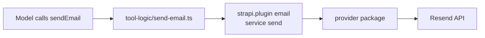

# Sending email

The `sendEmail` tool lets the model send mail through whatever email provider
Strapi is already configured with. This guide uses [Resend](https://resend.com/),
but nothing in the tool is Resend-specific. Current as of **2.6.0**.

## Contents

- [How it works](#how-it-works)
- [Setting up Resend](#setting-up-resend)
- [Granting the tool](#granting-the-tool)
- [Tool parameters](#tool-parameters)
- [Failure handling](#failure-handling)
- [Domain verification](#domain-verification)
- [Using it](#using-it)

---

## How it works

`sendEmail` does not talk to any mail API. It calls Strapi's own email service:

```typescript
strapi.plugin('email').service('email').send({ to, subject, html, text, cc, bcc, replyTo });
```

So the provider is whatever `@strapi/plugin-email` is configured with —
Sendmail, SendGrid, Mailgun, Resend, anything with a Strapi provider package.
Configure it once for the application and the tool follows.



The tool is tiered `access: 'destructive'` and is **not** `internal`, so it
reaches both admin chat and MCP, and needs an explicit permission grant on both.

Destructive is the right tier for it: sending mail is irreversible and has an
external side effect. It also means the tool is withdrawn once it has
successfully sent, so a model cannot send the same message twice in one turn.

---

## Setting up Resend

### 1. Install the provider

In your **Strapi application**, not the plugin directory:

```bash
npm install @strapi/plugin-email strapi-provider-email-resend
```

### 2. Configure it

```typescript
// config/plugins.ts
export default ({ env }) => ({
  email: {
    config: {
      provider: 'strapi-provider-email-resend',
      providerOptions: {
        apiKey: env('RESEND_API_KEY'),
      },
      settings: {
        defaultFrom: env('EMAIL_DEFAULT_FROM'),
        defaultReplyTo: env('EMAIL_DEFAULT_REPLY_TO'),
      },
    },
  },

  'ai-chat': {
    enabled: true,
    config: {
      apiKey: env('ANTHROPIC_API_KEY'),
    },
  },
});
```

### 3. Environment variables

```bash
RESEND_API_KEY=re_xxxxxxxxxxxx
EMAIL_DEFAULT_FROM=hello@yourdomain.com
EMAIL_DEFAULT_REPLY_TO=hello@yourdomain.com
```

The sender address is **not** a tool parameter. It comes from `defaultFrom`, so
the model cannot choose who the mail appears to be from.

### 4. Verify it independently

Before involving the model, confirm the provider works on its own:

```typescript
await strapi.plugin('email').service('email').send({
  to: 'you@example.com',
  subject: 'Test',
  html: '<p>It works.</p>',
});
```

If this fails, the tool will fail the same way. Fix it here first — the error is
much easier to read outside a chat transcript.

---

## Granting the tool

Like every other MCP-exposed tool, `sendEmail` starts ungranted:

```
plugin::ai-chat.tool.send-email
```

- **Settings > Administration Panel > Roles** — for admin chat. Under the
  **AI SDK** section, subcategory **AI tools**, tick **Send email**.
- **Settings > Administration Panel > Admin Tokens** — for MCP clients.

Super Admin has it automatically. Everyone else sees no such tool until it is
ticked, and the model is never offered it.

This is worth being deliberate about. It is the one built-in tool that can act
outside your Strapi instance.

---

## Tool parameters

| Parameter | Required | Notes |
|---|---|---|
| `to` | yes | Recipient address |
| `subject` | yes | |
| `html` | yes | Body as HTML; the model composes it |
| `text` | no | Plain-text fallback, derived from `html` if omitted |
| `cc` | no | |
| `bcc` | no | |
| `replyTo` | no | Falls back to `defaultReplyTo` |

The tool description instructs the model to confirm the recipient, subject and
body with the user before calling — repeating the address back and asking for
explicit approval — and to use exactly the address the user gave rather than
substituting a default or an admin address.

That is a prompt-level instruction, so treat it as a usability feature rather
than a control. If a model must never be able to mail arbitrary recipients, do
not grant the tool.

---

## Failure handling

`sendEmail` never throws. It returns a structured result:

```typescript
{ success: boolean, message: string, to: string, subject: string }
```

Returning rather than throwing is deliberate here. The message is written for
the model to read aloud, and every failure path names something the user can act
on.

**No email plugin installed:**

> The email plugin is not installed or enabled. Install `@strapi/plugin-email`
> and configure an email provider (e.g. `strapi-provider-email-resend`).

**Send failed:** the provider's own error, prefixed with the recipient.

Because `TOOL_DISCIPLINE` forbids the model from claiming an action it did not
complete, a failed send is reported as a failure rather than summarised as sent.

---

## Domain verification

The single most common failure, and the tool detects it specifically. When a
provider error matches `not allowed`, `verify`, `domain` or `can only send`, the
result appends:

> This usually means the sending domain is not verified in Resend. In test mode,
> emails can only be delivered to the account owner's address. Verify your
> domain at https://resend.com/domains to send to any recipient.

Resend's test mode only delivers to the address that owns the account. Everything
looks correctly wired, the tool reports failure, and the cause is a DNS record
rather than anything in Strapi. Verify the domain at
[resend.com/domains](https://resend.com/domains) before concluding the tool is
broken.

---

## Using it

**In admin chat:**

```
Email the draft summary of last week's posts to sarah@example.com
```

The model composes HTML, confirms the recipient with you, then sends.

**Over MCP**, once a token holds the grant, the tool appears as `send_email`.

**Directly**, bypassing the model entirely — call Strapi's email service, which
is all the tool does:

```typescript
await strapi.plugin('email').service('email').send({
  to: 'sarah@example.com',
  subject: 'Weekly summary',
  html: '<h1>This week</h1><p>...</p>',
});
```

Note that `sendEmail` itself is not importable: `strapi-plugin-ai-chat/strapi-server`
resolves to a bundle whose only export is the Strapi plugin object. The logic in
`tool-logic/send-email.ts` is a plain function of `(strapi, params)` with no
dependency on the registry, chat or MCP — which is what makes it testable — but
from outside the plugin, go through the email service directly. The only thing
you give up is the structured result and the domain-verification hint.
